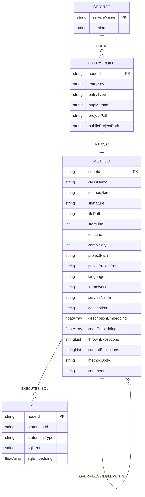

# 数据模型

---

## 1. 模型概览

数据分布在两个存储：

| 存储 | 用途 | 实体 |
|------|------|------|
| Neo4j 5.11+ | 代码知识图谱 + 向量 | `MethodNode` / `EntryPointNode` / `SqlNode` / `ServiceNode` / `GenerationCheckpointNode` |
| SQLite (`~/.hisi-devtool/devtool.db`) | 会话、任务、报告、配置 | `ClaudeSession` / `ClaudeMessage` / `WorkspaceSession` / 任务表 / 日志报告 |

DTO 主要在 `model/`、`neo4j/model/`、`knowledgegraph/model/`、`agent/model/`、`service/intent/`、`service/impact/model/`、`skill/model/` 等。

---

## 2. Neo4j 图谱 ER

---

## 3. 核心节点字段

### 3.1 `MethodNode`（`neo4j/model/MethodNode.java`）

| 字段 | 类型 | 说明 |
|------|------|------|
| `nodeId` | `String`（@Id） | `类名.方法名.签名hash` |
| `className` | String | 全限定类名 |
| `methodName` | String | 方法名 |
| `signature` | String | 方法签名 |
| `filePath` | String | 源文件路径 |
| `startLine` / `endLine` | Integer | 行号范围 |
| `complexity` | Integer | 圈复杂度 |
| `thrownExceptions` | `List<String>` | 抛出的异常 FQN 列表 |
| `caughtExceptions` | `List<String>` | 捕获的异常 FQN 列表 |
| `methodBody` | String | 方法体 |
| `projectPath` | String | 所属项目目录 |
| `publicProjectPath` | String | 跨项目共享检索范围键 |
| `language` | `"java"/"python"` | 旧节点 null 视为 java |
| `framework` | String | `spring/fastapi/django/flask` 等 |
| `serviceName` | String | 所属服务 |
| `comment` | String | 方法注释 |
| `description` | String | LLM 自然语言描述 |
| `descriptionEmbedding` | `float[]` | 描述向量（默认 4096 维，可配） |
| `codeEmbedding` | `float[]` | 代码向量 |

> 注意：实体不定义 `CALLS` 关系，避免 SDN 自动加载导致 N+1。调用关系通过 Repository 自定义查询获取。

### 3.2 `EntryPointNode`

含 `publicProjectPath`，标识 Controller / Scheduled / MQ Listener / Feign Client 等可被外部触达的入口。

### 3.3 `SqlNode`

由 MyBatis XML 扫描产生，含 `sqlEmbedding` 用于语义反查。

### 3.4 `GenerationCheckpointNode`

向量生成的断点记录，用于失败重试。

---

## 4. Repository 投影

`Neo4jMethodNodeRepository` 关键投影接口：

| 投影 | 含义 |
|------|------|
| `MethodWithScore` | 节点 + 分数（向量召回） |
| `CallerWithRelationByTarget` | 上游：caller + 调用关系 |
| `CalleeWithRelationBySource` | 下游：callee + 调用关系 |
| `MethodBySqlNode` / `SqlNodeByMethod` / `SqlWithScore` | SQL 反查 |

---

## 5. 通用 DTO（`model/`）

| 类 | 说明 |
|----|------|
| `ApiResponse<T>` | 统一响应包装：`success / data / error` |
| `ClaudeSession` | Claude 会话 |
| `ClaudeMessage` | 会话消息 |
| `WorkspaceSession` | 工作区 |
| `ScanResult` | 扫描结果聚合（HTTP / Feign / MQ / Endpoint） |
| `FeignClientInfo` | Feign 客户端信息 |
| `HttpCallInfo` | HTTP 调用信息 |
| `MQEndpoint` | MQ 端点信息 |

---

## 6. 任务 / 报告（SQLite）

| 表（约定） | 来源 | 用途 |
|-----------|------|------|
| `kg_generation_task` | `KnowledgeGraphTaskService` | 图谱构建任务（status / progress / startedAt / errors） |
| `claude_session` | `SessionServiceImpl` | Claude 会话 |
| `claude_message` | 同上 | 会话消息 |
| `workspace_session` | `WorkspaceSessionServiceImpl` | 工作区 |
| `log_analysis_report` | `RootCauseAnalysisServiceImpl` | 根因分析报告 |

> 表结构由 `SQLiteSchemaInitializer` 在 `@PostConstruct` 时建立；具体 DDL 见该类源码。

---

## 7. 枚举与常量

| 枚举 | 值 | 用途 |
|------|----|------|
| `QueryType`（`neo4j/model/QueryType.java`） | NATURAL_LANGUAGE / METHOD_NAME / FULL_QUALIFIED_NAME / CLASS_NAME / SQL_SNIPPET / HTTP_URI / CODE_SNIPPET / ANNOTATION / EXCEPTION_TYPE | 检索路由 |
| `MigrationStatus` | PENDING / RUNNING / SUCCESS / FAILED | 迁移任务状态 |
| `SearchErrorCode` | 见源码 | 检索异常码 |
| `IntentType`（`service/intent`） | 见源码 | 对话意图 |

`HybridSearchService` 内常量：`RRF_K=60` / `DEFAULT_TOP_K=10` / `DEFAULT_GRAPH_DEPTH=2` / `SIMILARITY_THRESHOLD=0.5` / `RELAXED_SIMILARITY_THRESHOLD=0.3` / `CONTEXT_LIMIT=3`。

---

## 8. 数据生命周期

| 实体 | 创建 | 更新 | 删除 |
|------|------|------|------|
| `MethodNode` | KnowledgeGraphBuilder | 增量刷新 / 重新生成向量 | 项目删除 / 仓库 git 文件删除 |
| `ClaudeSession` | TerminalWS 抓取到 sessionId 时 | 用户重命名 / 归档 | DELETE 接口 |
| `WorkspaceSession` | 用户创建 | 用户编辑 / 绑定 | DELETE 接口 |
| 任务记录 | TaskService 创建 | 心跳更新 | 不删除（历史保留） |
| 日志报告 | RootCauseAnalysis 完成 | 不更新 | 不删除（历史保留） |

---

## 9. 数据安全分类

| 数据 | 敏感级别 | 加密 / 脱敏 |
|------|---------|-----------|
| API Key | 高 | 环境变量；不入库；不入日志 |
| 仓库源码 | 中 | 仅本机；LLM 调用只发方法体片段 |
| 日志原文 | 中 | 不持久化原文；仅持久化结构化摘要 |
| Claude 会话 | 低 | SQLite 本地，跨用户不共享 |
| 用户名密码（CodeHub / 日志云） | 高 | 环境变量；ProxyConfig 透传时不打印 |
