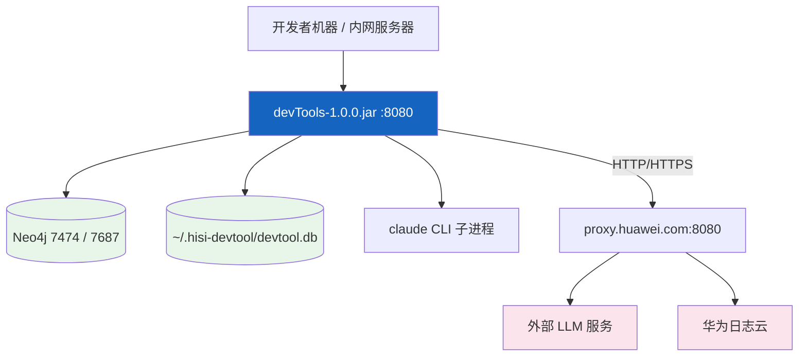

# 部署运维

---

## 1. 环境要求

| 依赖 | 版本要求 | 验证 |
|------|---------|------|
| JDK | 17+（LTS） | `java -version` |
| Maven | 3.8+ | `mvn -v` |
| Neo4j | 5.11+（含 APOC + GDS 插件） | `RETURN apoc.version(), gds.version()` |
| Docker（可选） | 任意版本 | `docker --version` |
| 浏览器（可选） | Chromium（Playwright 自动下载） | — |
| `claude` CLI（可选） | 最新版 | `claude --version` |

---

## 2. 环境变量

| 变量 | 必填 | 默认 | 说明 |
|------|------|------|------|
| `NEO4J_PASSWORD` | 是 | `12345678` | Neo4j 密码 |
| `EMBEDDING_API_KEY` | 是 | — | OpenAI 兼容 embedding 服务 key |
| `TEXT_MODEL_API_KEY` | 是 | — | OpenAI 兼容 chat 服务 key |
| `DB_PASSWORD` | 否 | — | （旧）关系型 DB 密码，已废弃 |
| `CORS_ALLOWED_ORIGINS` | 否 | `http://localhost:5173,5174,5175,3000` | 跨域白名单 |
| `IMPACT_DEFAULT_COVERAGE_SCORE` | 否 | `50` | 影响分析覆盖率兜底 |
| `PROXY_ENABLED` / `PROXY_HOST` / `PROXY_PORT` / `PROXY_TYPE` / `PROXY_USERNAME` / `PROXY_PASSWORD` | 否 | `true / proxy.huawei.com / 8080 / HTTP` | HTTP 代理 |
| `PROXY_NON_HOSTS` | 否 | `localhost,127.0.0.1` | 不走代理的地址 |
| `PROXY_DISABLE_SSL_VERIFICATION` | 否 | `true` | 内网调试用 |
| `LOGCLOUD_USERNAME` / `LOGCLOUD_PASSWORD` | 否 | — | 日志云 Playwright 模式登录 |
| `LOGCLOUD_APPKEY` | 否 | `placeholder` | 日志云 HTTP API key |
| `CODEHUB_USERNAME` / `CODEHUB_PASSWORD` | 否 | `placeholder` | 拉代码用 |

---

## 3. 构建与启动

### 3.1 准备 Neo4j

方式 A：Neo4j Desktop 或 Server，安装 APOC + GDS 插件并启动。

方式 B：仓库内置 Docker Compose

```bash
docker compose -f docker-compose.neo4j.yml up -d
```

启动后可在 Neo4j Browser（`http://localhost:7474`）执行 `check_neo4j.cypher` 校验。

### 3.2 编译

```bash
mvn clean package -DskipTests
```

产物：`target/devTools-1.0.0.jar`

### 3.3 启动

```bash
# 设置环境变量后启动
java -jar target/devTools-1.0.0.jar
# 或
mvn spring-boot:run
# 或使用 scripts/ 下封装脚本（如 start.sh）
```

启动后日志应包含 `Neo4j 初始化完成: 成功=N, 失败=0`。

---

## 4. Profile

| Profile | 文件 | 用途 |
|---------|------|------|
| `dev`（默认） | `application.yml` | 本地开发 |
| `prod` | `application-prod.yml` | 生产 / 内网服务 |

切换：`-Dspring.profiles.active=prod` 或 `SPRING_PROFILES_ACTIVE=prod`。

---

## 5. 部署架构



---

## 6. 健康检查

| 项 | 端点 | 说明 |
|----|------|------|
| 应用 | `GET /actuator/health` | Spring Actuator |
| 业务 | `GET /api/ops/health` | `OpsController` 内自定义检查 |
| Neo4j | `RETURN 1` | Neo4j Browser 验证 |

---

## 7. 日志

`src/main/resources/logback-spring.xml` 控制日志输出。模块级别：

| 模块 | 默认级别 |
|------|---------|
| `com.huawei.hisi` | info |
| `com.huawei.hisi.neo4j` | debug |
| `com.huawei.hisi.knowledgegraph` | debug |
| `org.springframework` | warn |

可通过环境变量 `LOG_LEVEL_*` 或 `application.yml` 调整。

---

## 8. 数据备份

| 对象 | 路径 | 备份方式 |
|------|------|---------|
| SQLite | `~/.hisi-devtool/devtool.db` | 直接复制文件 |
| Neo4j | Neo4j 数据目录 | `neo4j-admin database dump` |

---

## 9. 升级 / 索引迁移

切换嵌入模型（如从 4096 → 2048 维）后：

1. 修改 `application.yml: embedding.dimension`
2. 重启应用，`Neo4jInitializer` 检测维度变化 → 删除旧索引 + 重建
3. 触发 `/api/vector-generation/...` 重新生成所有方法的向量

---

## 10. 常见问题

| 问题 | 原因 | 解决 |
|------|------|------|
| `Connection refused 7687` | Neo4j 未启动 | 启动 Neo4j Desktop / docker compose up |
| `EMBEDDING_API_KEY must not be null` | 环境变量未注入 | 设置后重启 |
| 向量索引创建失败 | Neo4j 版本 < 5.11 | 升级 Neo4j |
| Playwright 启动慢 | 首次下载 Chromium | 等待或预下载 |
| 端口 8080 占用 | 其他进程占用 | 修改 `server.port` |
| 内网代理 SSL 报错 | 证书自签 | `PROXY_DISABLE_SSL_VERIFICATION=true` |
| 中文乱码（终端） | Windows 默认 GBK | `chcp 65001` 切换 UTF-8 |

---

## 11. 监控（可选）

`spring-boot-starter-actuator` 暴露 `/actuator/*` 端点，可对接 Prometheus（默认未启用 micrometer-prometheus）。

---

> **延伸阅读**：
> - 架构 → [02-架构设计](../02-架构设计/index.md)
> - 配置项详解 → [03-模块说明/应用启动与全局配置](../03-模块说明/应用启动与全局配置.md)
