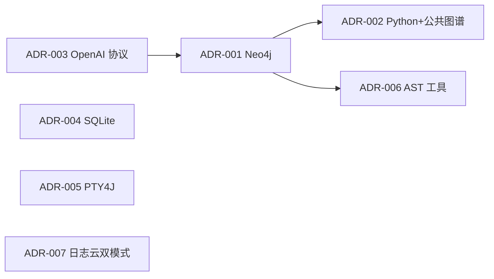

# 技术决策记录（ADR）

> 以下决策从代码现状、`pom.xml`、`application.yml`、CLAUDE.md 反推。状态以"已采纳"为主。

---

## 1. 决策概览

| ADR | 标题 | 状态 | 影响范围 |
|-----|------|------|---------|
| ADR-001 | 主存储从关系型数据库迁移至 Neo4j | 已采纳 | 全部图谱/检索能力 |
| ADR-002 | Python 支持 + 公共图谱（`publicProjectPath`） | 已采纳 | 知识图谱构建、检索路由、节点 schema |
| ADR-003 | 通过 OpenAI 兼容协议统一抽象 LLM | 已采纳 | embedding / text-model 配置、`UnifiedEmbeddingService` / `UnifiedTextService` |
| ADR-004 | SQLite 作为本地元数据存储 | 已采纳 | 会话 / 任务 / 报告 |
| ADR-005 | 通过 PTY4J 集成本地 Claude CLI | 已采纳 | 终端 WebSocket |
| ADR-006 | Java AST 选 JavaParser + Symbol Solver；Python AST 选 ANTLR4 + Python3.g4 | 已采纳 | 知识图谱构建 |
| ADR-007 | 日志云双模式（HTTP API 优先 + Playwright 兜底） | 已采纳 | 日志诊断 |

---

## 2. ADR-001：主存储迁移至 Neo4j

- **状态**：已采纳（v4.0+）
- **背景**：v3.x 使用 OpenGauss/MySQL 关系型存储，调用关系靠多表 JOIN，跨度大时性能差；引入 RAG 后又需要单独维护 ChromaDB，多套存储一致性难。
- **决策**：迁移到 Neo4j 5.11+，同时利用其原生 VECTOR INDEX（cosine）承载向量检索，CLAUDE.md 明确"ChromaDB / hisi-vector-service 已与 Java 后端解耦"。
- **备选**：

| 方案 | 优 | 缺 | 评分 |
|------|----|----|------|
| Neo4j 5.11+ ✅ | 图 + 向量一体；Cypher 表达力强 | 学习成本；需要 APOC/GDS 插件 | 9/10 |
| OpenGauss + Pgvector | 复用现有 DBA | 调用链查询复杂、多 JOIN | 6/10 |
| Neo4j + ChromaDB | 各专所长 | 双写一致性、运维双组件 | 5/10 |
- **理由**：单组件承载多模态查询，运维成本最低。
- **影响**：
  - 节点字段改 camelCase（`projectPath` / `language` / `descriptionEmbedding` 等）
  - `Neo4jInitializer` 需要在启动时建索引
  - 旧 OpenGauss 配置废弃（README 仍残留 PG 描述待更新）

---

## 3. ADR-002：Python 支持 + 公共图谱

- **状态**：已采纳
- **背景**：用户既有 Java 仓库也有 Python 仓库；同一 rootPath 下多模块希望统一检索。
- **决策**：
  1. 节点新增 `language` (`java/python`) 与 `framework` 字段
  2. 新增 `publicProjectPath` 范围键，单项目 = `projectPath`，公共图谱 = 用户选定 rootPath
  3. 范围查询统一使用 `coalesce(n.publicProjectPath, n.projectPath) = $scope`
  4. `HybridSearchService` 增加 `scope` / `language` 参数重载
  5. Python 子图谱使用 ANTLR4 + Python3.g4
- **影响**：节点 schema 兼容旧数据（`language` null 视为 java）；`Neo4jInitializer` 自动 backfill `publicProjectPath` 索引。

---

## 4. ADR-003：OpenAI 兼容协议统一 LLM

- **状态**：已采纳
- **背景**：早期分别集成智谱、SiliconFlow、讯飞各自 SDK，配置散乱、切换昂贵。
- **决策**：统一通过 OpenAI 兼容的 `/embeddings` 与 `/chat/completions` 端点访问。`application.yml` 仅留 `embedding.*` 与 `text-model.*` 两段，后端通过 `UnifiedEmbeddingService` / `UnifiedTextService` 调用。
- **遗留**：`ZhipuConfig` / `IFlytekConfig` / `SiliconFlowConfig` 仍保留，但 `enabled=false`，仅向后兼容。
- **当前默认**：embedding=SiliconFlow `Qwen/Qwen3-VL-Embedding-8B` (4096 维)；text=智谱 `glm-4-flash`。

---

## 5. ADR-004：SQLite 本地元数据

- **状态**：已采纳
- **背景**：作为开发者本机工具，引入独立数据库（PostgreSQL）部署成本太高。
- **决策**：使用 SQLite，文件位 `~/.hisi-devtool/devtool.db`，由 `SQLiteSchemaInitializer` 启动建表。
- **影响**：单实例使用，跨机不共享；备份只需复制文件。

---

## 6. ADR-005：PTY4J 集成 Claude CLI

- **状态**：已采纳
- **背景**：直接 `ProcessBuilder` 无法承载 ANSI 控制序列、TUI 框、resize 事件，Claude CLI 体验差。
- **决策**：使用 PTY4J 创建伪终端，前端通过 WebSocket 双向桥接。
- **影响**：跨平台依赖原生库（Windows/Linux/macOS 均支持）；需要正则识别"Claude ready"状态以同步 UI。

---

## 7. ADR-006：AST 工具选型

- **状态**：已采纳
- **Java**：JavaParser 3.27.0 + Symbol Solver。
  - 备选：Eclipse JDT。理由：依赖少、API 简洁，足够覆盖 Spring 注解解析。
- **Python**：ANTLR4 4.13.1 + Python3.g4。
  - 备选：tree-sitter（运行时绑定复杂）；Jython（已停滞）。理由：纯 Java、Maven 插件可生成、离线可用。

---

## 8. ADR-007：日志云双模式

- **状态**：已采纳
- **背景**：日志云 HTTP API 速率受限、部分查询权限收紧；UI 端可拿到全量。
- **决策**：以 HTTP API 为主，Playwright 自动化为兜底。`LogCloudConfig` 同时承载两套配置。
- **影响**：依赖 Playwright 浏览器二进制，首次启动慢；生产部署需注意 headless 模式。

---

## 9. 决策原则

| 原则 | 说明 |
|------|------|
| 单组件优先 | 能用一个外部服务承载就不引第二个（Neo4j 兼图与向量） |
| 配置先于代码切换 | LLM、代理、CORS 全靠 yaml + 环境变量 |
| 失败降级 | 缺 `neo4j.uri` 不阻断启动；外部 LLM 失败不阻断主链路 |
| 工具属性 | 一切以"开发者本机工具"为前提（单实例、SQLite、本地 PTY） |
