# HiSi DevTool —— 代码知识图谱驱动的智能开发平台

> 📅 部门技术宣讲材料 | 建议时长：35min 正式 + 10min Demo + 5min Q&A

---

## 📋 宣讲议程

| # | 章节 | 时长 | 关键词 |
|---|------|------|--------|
| 1 | 我们遇到了什么问题？ | 4min | 痛点共鸣 |
| 2 | HiSi DevTool 是什么 | 3min | 产品定位 |
| 3 | 五大核心能力 | 12min | 能力展示 |
| 4 | 四个真实场景 | 10min | 价值证明 |
| 5 | 技术巧思与架构亮点 | 4min | 技术深度 |
| 6 | 演进之路与未来 | 2min | 思考过程 |
| 7 | Live Demo | 10min | 眼见为实 |
| 8 | Q&A | 5min | 互动 |

---

# 一、我们遇到了什么问题？

## 1.1 大型代码仓的理解成本

> 想象一下：你刚接手一个 **50 万行、200+ 微服务** 的 Java 项目，领导说"下周上线一个涉及支付链路的需求"。

你会面对这些问题：

- **"这个方法被谁调了？"** —— 全局搜索 `Ctrl+Shift+F`，200 个结果，一个个看？
- **"改了这个 DAO，影响哪些接口？"** —— 凭经验？问老员工？
- **"线上报了 NPE，根因在哪？"** —— 翻 5 个微服务的日志，拼凑调用链？
- **"新来的同事问这段代码干啥的"** —— 你花 30 分钟口头讲一遍，下次另一个新人再问一遍？

## 1.2 现有工具的局限

| 工具 | 能做的 | 做不到的 |
|------|--------|----------|
| IDE（IntelliJ） | 单项目内跳转、Find Usages | 跨项目调用链、语义搜索、影响范围评估 |
| SonarQube | 代码质量扫描（bug/smell） | 不理解业务语义，不能回答"这方法是干啥的" |
| SourceGraph | 跨仓正则搜索 | 没有调用关系图，不能做影响分析 |
| CodeScene | 热点分析、技术债 | 不支持中文语义、没有图谱、没有 AI 对话 |

**缺一个工具：能像一个资深老员工一样，"理解"代码、"回答"问题、"预警"风险。**

---

# 二、HiSi DevTool 是什么

## 一句话定位

> **用知识图谱把代码"读懂"，用 AI 把答案"说出来"的开发者智能助手。**

## 产品能力全景

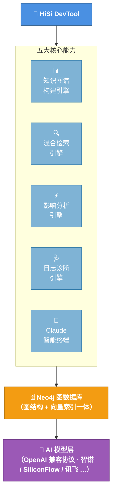

## 面向谁？

| 角色 | 核心诉求 | HiSi 怎么帮 |
|------|---------|-------------|
| **后端开发** | 快速理解代码、评估改动影响 | 图谱 + 影响分析 + 语义搜索 |
| **测试工程师** | 精准定位回归范围 | 影响链路 → 自动推荐测试用例 |
| **SRE / 运维** | 快速定位线上问题根因 | 日志诊断 + 异常路径追踪 |
| **新人 / 转岗** | 快速上手陌生项目 | 自然语言问答 + 可视化调用图 |
| **AI 工具集成方** | 通过 API / MCP 接入图谱能力 | REST 接口 + OpenAI 兼容协议 + MCP Server |

---

# 三、五大核心能力

## 能力 1：代码知识图谱 —— 让代码"结构化"

### 做了什么

把一个 Java/Python 项目自动扫描为 **知识图谱**：

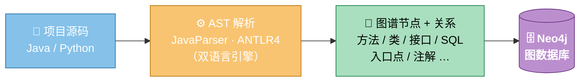

### 图谱里有什么

| 节点类型 | 示例 | 蕴含信息 |
|---------|------|---------|
| **MethodNode** | `OrderService.createOrder()` | 签名、注释、所属类、代码片段、AI 生成的描述 |
| **EntryPointNode** | `POST /api/orders` | HTTP 入口、关联 Controller 方法 |
| **SqlNode** | `SELECT * FROM orders WHERE ...` | MyBatis/JPA 中的 SQL 语句 |
| **ServiceNode** | `OrderService` | 类级别聚合，含继承/实现关系 |

| 关系类型 | 含义 |
|---------|------|
| `CALLS` | 方法 A 调用方法 B |
| `EXTENDS` / `IMPLEMENTS` | 继承、实现 |
| `HAS_SQL` | 方法内含 SQL 操作 |
| `EXPOSES` | 入口点暴露的方法 |

### 巧思亮点

- **增量更新**：基于 Git 变更检测（`git status`）只重建变更文件的图谱节点，不是每次全量扫
- **双语言 AST**：Java 用 JavaParser（类型推断精度高），Python 用 ANTLR4（语法灵活性强），同一套图谱模型统一存储
- **AI 增强描述**：每个方法节点自动调 LLM 生成一段自然语言描述，这是后面"语义搜索"的基础
- **跨服务图谱**：自动识别 Feign Client、MQ Listener、HTTP 调用等跨服务调用方式，将多个微服务的调用关系串联成一张完整的图——不再局限于单个项目内部

---

## 能力 2：混合检索引擎 —— 怎么搜都能搜到

### 传统搜索的问题

- **关键词搜索**：搜"支付"，但方法名叫 `processTransaction` → 搜不到
- **纯向量搜索**：搜"com.order.OrderService.pay"，返回一堆语义相关但不精确的结果

### 我们的方案：9 种查询策略 + RRF 融合

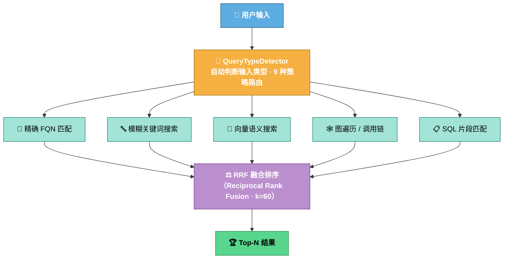

### 9 种 QueryType 一览

| 类型 | 触发条件 | 示例 |
|------|---------|------|
| 全限定名匹配 | 输入是完整包名.类名.方法名 | `com.order.OrderService.pay` |
| 类名匹配 | 大驼峰类名 | `OrderService` |
| 方法名匹配 | 方法名或含括号 | `createOrder(String, int)` |
| 注解匹配 | `@` 开头 | `@Transactional` |
| SQL 片段匹配 | 含 SQL 关键字 | `SELECT * FROM orders` |
| HTTP 路径匹配 | HTTP 方法 + 路径 | `GET /api/orders` |
| 代码片段匹配 | 代码风格的输入 | `if (user == null) throw ...` |
| 异常类型匹配 | 异常类名 | `NullPointerException` |
| 自然语言 | 中文/英文自然语言 | "查找所有涉及权限校验的方法" |

### 巧思亮点

- **RRF 融合**：不是简单合并，用 Reciprocal Rank Fusion（k=60）把多路结果统一排序，信息检索领域的最佳实践
- **Neo4j 原生向量索引**：向量和图结构在同一个数据库里，不需要额外维护 Milvus/Pinecone，一次查询同时走图遍历和向量检索
- **三种 Embedding**：每个方法节点有 `descriptionEmbedding`（描述语义）、`codeEmbedding`（代码语义）、`sqlEmbedding`（SQL 语义），不同查询命中不同向量

---

## 能力 3：影响分析 —— 改一行代码，影响几百个接口？

### 解决什么问题

> 开发说"我就改了一个工具方法"，测试问"那我要回归哪些用例？"

### 工作原理

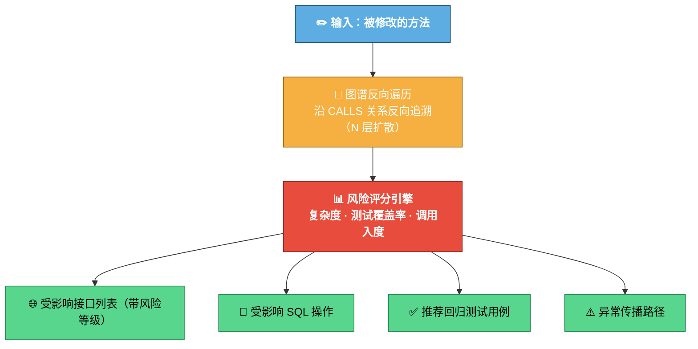

### 四个子能力

| 子能力 | 说明 |
|--------|------|
| **影响预测** | 从修改点出发，图谱 N 层扩散，列出所有受影响的上游调用者 |
| **风险评分** | 综合复杂度、测试覆盖率、调用入度给出 P0-P3 风险等级 |
| **测试推荐** | 基于受影响的 EntryPoint 推荐需要回归的测试用例 |
| **异常路径分析** | 追踪异常在调用链中的传播路径（谁 catch 了？谁没 catch？） |

### 巧思亮点

- **图数据库的天然优势**：调用关系就是图的边，N 层扩散就是 N 跳遍历，用 Cypher 一条语句搞定，关系型数据库做不到
- **结合入口点**：不只告诉你"哪些方法受影响"，还直接关联到"哪些 HTTP 接口受影响"——测试可以直接拿去写回归用例

---

## 能力 4：日志诊断 —— 从报错到根因，一键到位

### 传统排障流程


### HiSi DevTool 排障流程


### 工作原理

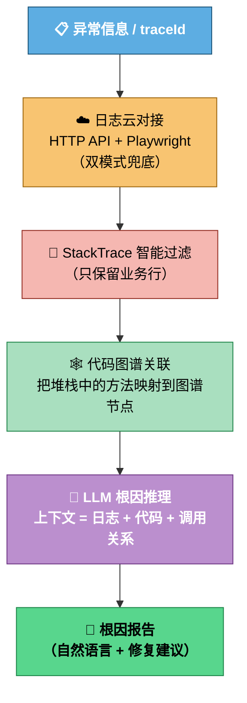

### 巧思亮点

- **双模式日志获取**：HTTP API 优先（快、稳），Playwright 浏览器自动化兜底（覆盖未开放 API 的场景）——不挑平台
- **图谱 × 日志**：不是单纯让 AI 读日志猜，而是把日志中的方法名映射到知识图谱，让 AI 结合调用关系一起推理——准确率大幅提升
- **异步报告**：分析任务异步执行，前端可轮询进度，不阻塞操作

---

## 能力 5：Claude 智能终端 —— 对话式编程助手

### 做了什么

在 Web 前端内嵌了一个完整的 **Claude CLI 终端**，通过 WebSocket + PTY（伪终端）技术让用户直接在浏览器中和 Claude 对话。

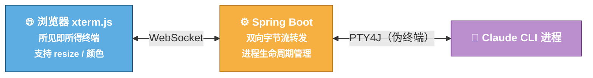

### 配套能力

| 能力 | 说明 |
|------|------|
| **会话管理** | 每次对话自动持久化到 SQLite，支持回看、导出、归档 |
| **工作区绑定** | 一个工作区可绑定多个 Claude 会话，按项目组织 |
| **技能市场** | 预置开发技能包（代码审查、重构建议等），一键安装到当前项目 |
| **提示词模板** | 内置 + 自定义提示词，支持变量渲染 `{{className}}` → 实际值 |

---

# 四、四个真实场景

## 场景 A：新人接手大项目 —— "3 天变 3 小时"

### 故事

> 小王刚从另一个部门转来，要接手一个 30 万行的订单系统。

**传统方式**：读文档（如果有的话）→ 翻代码 → 问老员工 → 画架构图 → 大概 3 天理清脉络

**用 HiSi DevTool**：

```
第 1 步：一键扫描，生成知识图谱
         $ 配置项目路径 → 点击"构建图谱"
         → 10 分钟后，30 万行代码变成可视化的调用关系图

第 2 步：搜索核心入口
         搜索框输入："POST /api/orders"
         → 直接定位到 OrderController.createOrder()
         → 展开调用链：Controller → Service → DAO → SQL

第 3 步：自然语言提问
         输入："帮我梳理订单支付的完整链路"
         → AI 基于图谱给出完整的调用路径 + 每一步的自然语言说明

第 4 步：可视化浏览
         → 在图谱可视化界面，直观看到哪些服务是核心枢纽
         → 哪些模块耦合度高（入边/出边多）
```

**效果**：3 天 → 3 小时，而且理解深度更高（因为有全局调用关系视角）

---

## 场景 B：评估改动影响 —— "改之前就知道会炸哪"

### 故事

> 后端同学小李要重构 `UserService.validatePermission()` 方法。领导问："影响范围多大？要不要全量回归？"

**传统方式**：Find Usages → 一层层往上找 → 不确定间接调用 → 为了稳妥做全量回归 → 浪费 2 天测试资源

**用 HiSi DevTool**：

```
第 1 步：输入被修改方法
         → 选择 UserService.validatePermission()

第 2 步：一键影响分析
         → 系统沿图谱反向遍历 3 层
         → 输出：
           🔴 P0 高风险：OrderController.createOrder (直接调用)
           🟡 P1 中风险：PaymentService.process (间接 2 层)
           🟢 P2 低风险：ReportService.generate (间接 3 层)
         → 受影响 HTTP 接口：POST /api/orders, POST /api/payments, ...
         → 受影响 SQL：UPDATE orders SET status=...

第 3 步：测试推荐
         → 基于受影响的 EntryPoint 自动推荐回归用例
         → 测试只需要跑 12 个用例，不是全量 500 个
```

**效果**：从"不确定，全量回归"变成"精确影响范围 + 精准回归"，节省 80% 测试资源

---

## 场景 C：线上问题定位 —— "从报错到根因，3 分钟"

### 故事

> 凌晨 2 点，告警群弹出一条：`NullPointerException at OrderService.java:127`

**传统方式**：登录日志平台 → 搜 traceId → 翻上下文 → 定位到某个 null 字段 → 不确定是谁传进来的 → 看代码 → 再看日志 → 30 分钟～1 小时

**用 HiSi DevTool**：

```
第 1 步：粘贴异常信息
         → 输入 stackTrace 或 traceId

第 2 步：一键分析
         → 系统自动拉取关联日志（双模式对接日志云）
         → 过滤出业务行堆栈
         → 在图谱中定位 OrderService.createOrder → validate → getUser
         → AI 结合代码上下文推理根因

第 3 步：输出报告
```

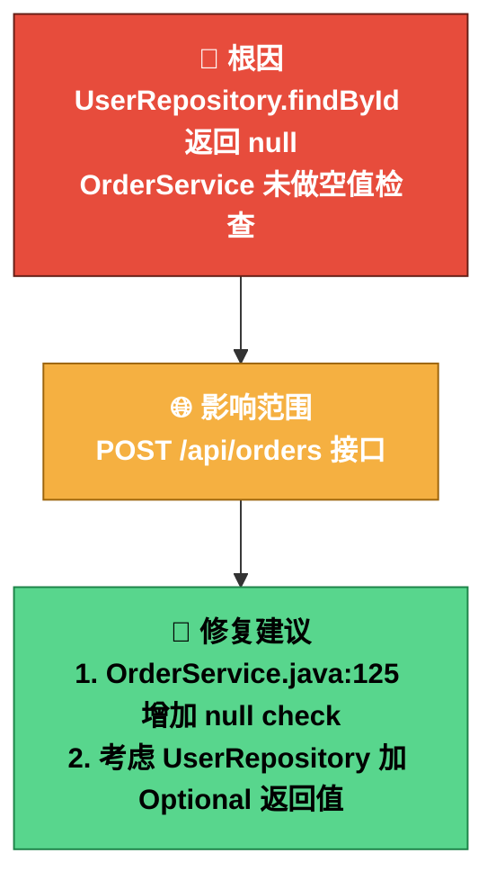

**效果**：30min+ → 3min，且给出的不是"猜测"而是基于代码结构的"推理"

---

## 场景 D：语义搜索 —— "用人话搜代码"

### 故事

> 安全审计要求：找出所有涉及"权限校验"的方法，确认是否有遗漏。

**传统方式**：搜 `permission`、`auth`、`check`、`validate` ... 各种关键词组合 → 漏搜、误搜、耗时

**用 HiSi DevTool**：

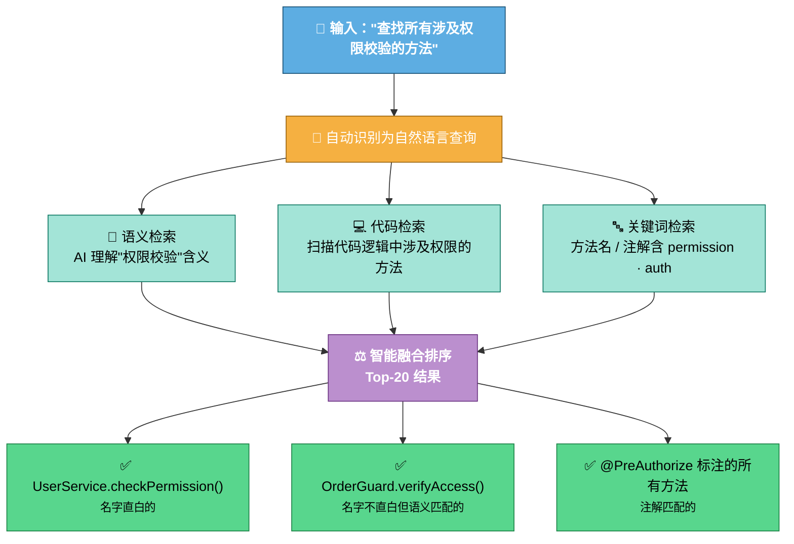

**效果**：不用绞尽脑汁想关键词，用自然语言描述意图即可，召回率远高于纯关键词搜索

---

# 五、技术巧思与架构亮点

## 5.1 Neo4j 一体化存储 —— 图 + 向量，一个库搞定

| 传统方案 | 我们的方案 |
|---------|-----------|
| MySQL 存结构 + Milvus 存向量 + Redis 缓存 | **Neo4j 一个库**：节点/关系（图结构）+ 原生 VECTOR INDEX（向量检索） |
| 三套系统维护、数据同步、一致性问题 | 零同步开销，一条 Cypher 同时做图遍历 + 向量搜索 |

> **为什么可以这么做？** Neo4j 5.11+ 原生支持 VECTOR INDEX（cosine similarity），不需要外挂向量数据库。这个决策让架构复杂度降低了一个量级。

## 5.2 OpenAI 协议统一抽象 —— 换模型不改代码

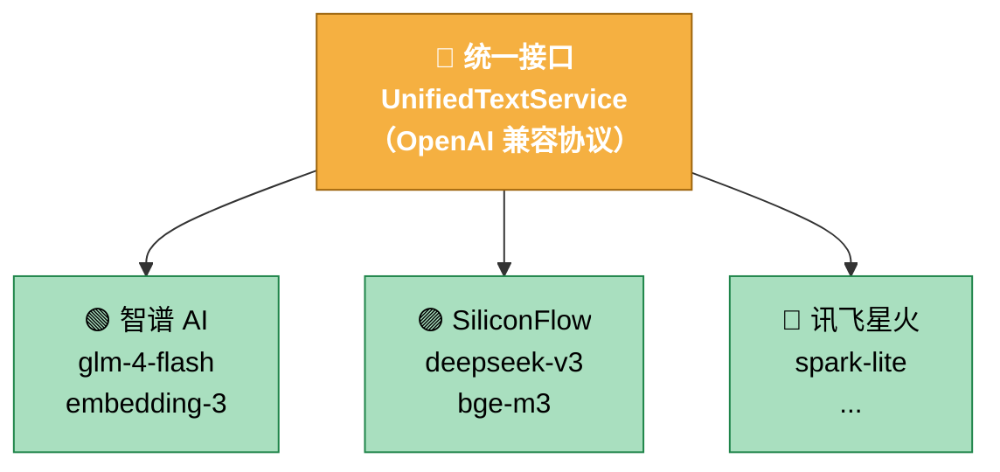

所有 LLM 调用走 OpenAI 兼容协议，`application.yml` 里改一行配置就能切换模型厂商，**零代码改动**。

## 5.3 多语言统一图谱 —— Java + Python 同一张图

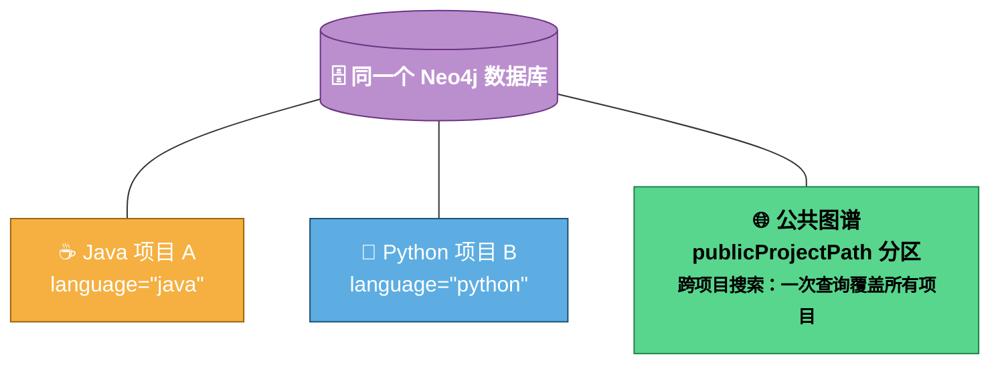

- `publicProjectPath` 字段实现租户级别的数据隔离
- `language` 字段实现语言感知的过滤
- `coalesce(n.publicProjectPath, n.projectPath)` —— 一条 Cypher 兼容单项目和公共图谱

## 5.4 与同类工具对比

| 维度 | SonarQube | SourceGraph | CodeScene | **HiSi DevTool** |
|------|-----------|-------------|-----------|-------------------|
| 代码质量扫描 | ✅ 强 | ❌ | ✅ | ⚠️ 非核心 |
| 语义搜索 | ❌ | ❌ | ❌ | ✅ 向量+关键词+图 |
| 调用链分析 | ❌ | ⚠️ 基础 | ❌ | ✅ 图谱 N 层遍历 |
| 影响分析 | ❌ | ❌ | ⚠️ 基于历史 | ✅ 图谱+风险评分 |
| 日志根因诊断 | ❌ | ❌ | ❌ | ✅ 日志×图谱×AI |
| AI 对话 | ❌ | ⚠️ Cody | ❌ | ✅ Claude 终端 |
| 多语言图谱 | N/A | N/A | N/A | ✅ Java+Python |
| 部署方式 | 服务端 | 服务端 | SaaS | **本地部署，数据不出域** |

---

# 六、演进之路 —— 每一步都是思考

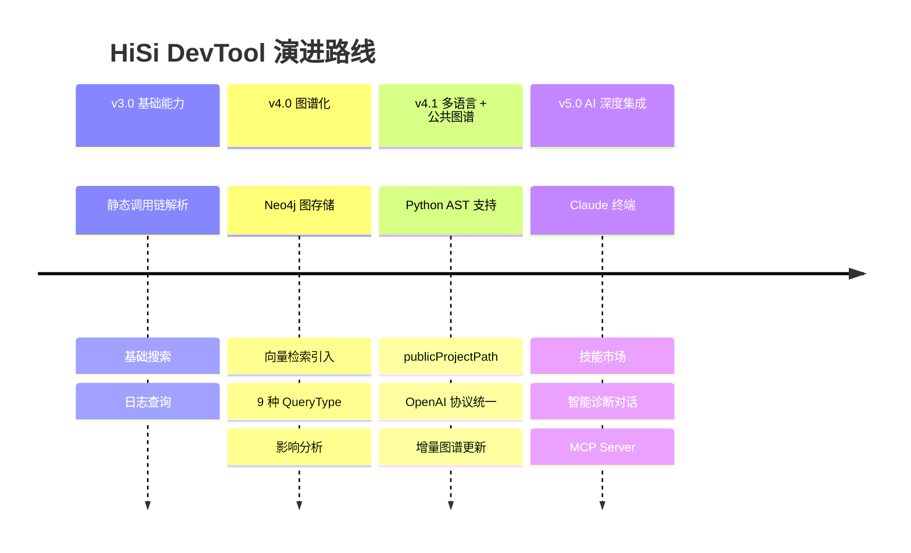

### 关键突破点

| 版本 | 决策 | 思考 |
|------|------|------|
| v3→v4 | 从关系型数据库迁移到 Neo4j | 调用关系天然是图，SQL JOIN 做 N 层遍历性能灾难 → 换图数据库后，影响分析从"不可用"变"秒级" |
| v4.0 | Neo4j 原生向量索引替代 ChromaDB | 减少一个组件 = 减少一类故障，且图+向量联合查询能力是独有优势 |
| v4.1 | Python 支持 + 公共图谱 | 业务需求驱动：团队有 Java + Python 混合技术栈，必须统一管理 |
| v4→v5 | 集成 Claude CLI 终端 | AI 不应该只是后台引擎，开发者应该能直接对话——把 Claude 搬进工具里 |

---

# 七、Live Demo 建议流程

> ⏱️ 10 分钟，建议按以下顺序演示

### Demo 1：一键构建图谱（2min）

- 选择一个中等规模的 Java 项目
- 点击构建 → 展示图谱可视化（节点数、关系数、类分布）
- **讲解点**："50 万行代码，10 分钟变成可视化的知识图谱"

### Demo 2：混合搜索（3min）

- 精确搜索：输入一个全限定类名 → 秒级定位
- 语义搜索：输入"查找所有跟支付相关的方法" → 展示多路融合结果
- **讲解点**："不管你记得类名还是只记得功能，都能搜到"

### Demo 3：影响分析（3min）

- 选择一个底层方法 → 点击影响分析
- 展示影响树：哪些接口受影响、风险等级、推荐测试用例
- **讲解点**："改代码之前先看影响范围，上线事故减少 80%"

### Demo 4：自然语言对话（2min）

- 在 Claude 终端中提问："这个项目的核心入口有哪些？"
- 展示 AI 结合图谱给出的回答
- **讲解点**："新人培训成本大幅下降"

---

# 八、总结

## 核心价值

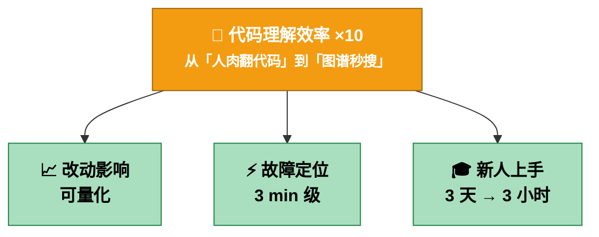

## 一句话

> **HiSi DevTool = 知识图谱 × AI × 工程实践，让每个开发者都拥有"资深老员工"的代码理解力。**

---

# 附录：技术规格速查

| 项 | 值 |
|---|---|
| 后端框架 | Spring Boot 3.2.0 + Java 17 |
| 图数据库 | Neo4j 5.11+（原生 VECTOR INDEX, cosine） |
| 向量维度 | 4096d（默认 Qwen3-VL-Embedding-8B，可切换智谱 embedding-3 / 讯飞等） |
| 本地存储 | SQLite |
| AI 模型 | OpenAI 兼容协议，默认 glm-4-flash（文本）+ Qwen3-VL-Embedding-8B（向量），一行配置切换厂商 |
| AST 解析 | Java: JavaParser / Python: ANTLR4 |
| 终端方案 | PTY4J + WebSocket + xterm.js |
| 前端 | Vue 3 + Element Plus + TypeScript |
| 部署 | 本地部署，数据不出域 |
| 开源地址 | github.com/shenjiangchun/codeKnowledge |

---

> 📝 **演讲备注**：每个场景讲完后可以停顿问一句"大家在日常工作中有没有遇到类似的问题？"，增加互动感。Demo 环节如果时间紧，优先演示场景 B（影响分析）和场景 D（语义搜索），这两个最容易让非技术领导"哇"出来。
