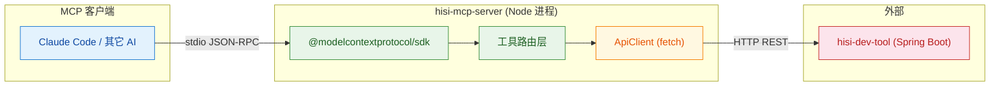
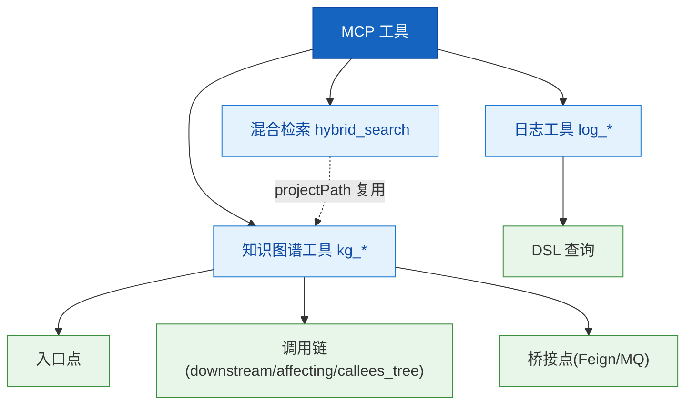

# 项目概览

---

## 1. 使命与定位

### 1.1 项目使命

> 把 HiSi 开发工具套件后端 (`hisi-dev-tool`) 的知识图谱、混合检索、日志分析能力,通过 **Model Context Protocol** 标准协议暴露给 Claude Code 等 AI 客户端,让 LLM 可以像调用本地函数一样查询代码和日志。

### 1.2 目标用户

| 用户角色 | 使用场景 | 核心诉求 |
|---------|---------|---------|
| AI 编程助手 (Claude Code 等) | 代码理解、调用链分析、日志排错 | 通过 MCP 工具一致地访问 HiSi 后端能力 |
| 后端开发者 | 配置 MCP 客户端、扩展工具 | 简洁、易扩展的工具层 |
| 集成方 | 在 IDE / Agent 中嵌入 HiSi 能力 | 标准 MCP 协议、零额外认证 |

### 1.3 项目边界

| 范围 | 说明 |
|------|------|
| **做** | MCP 协议适配、工具 schema 声明、入参规范化、HTTP 透传到后端 |
| **不做** | 知识图谱构建、向量检索算法、日志采集 (均由后端 `hisi-dev-tool` 实现) |
| **未来可能** | SSE / HTTP 传输、鉴权、本地缓存、Prompt 资源 |

---

## 2. 技术栈

### 2.1 技术栈总览

| 层 | 技术 | 版本 | 说明 | 选型理由 |
|----|------|------|------|---------|
| 运行时 | Node.js | >=18 | 异步运行时,原生 fetch / AbortController | 满足 MCP SDK 要求,自带 fetch 免依赖 |
| 语言 | TypeScript | ^5.0 | strict 模式、ES2022 输出 | 工具入参 schema 与类型同源 |
| 模块解析 | NodeNext (ESM) | - | `"type": "module"` | 与 MCP SDK 一致 |
| MCP 协议 | @modelcontextprotocol/sdk | ^1.0.0 | Server / StdioServerTransport / Schemas | 官方 SDK |
| 通信 | 原生 fetch | Node 18+ | 调用后端 REST API | 零依赖 |
| 后端 | (外部) hisi-dev-tool | - | Spring Boot REST API | 实际能力提供方 |

### 2.2 技术栈关系图



---

## 3. 项目结构

### 3.1 目录树

```
hisi-mcp-server/
├── src/
│   ├── index.ts                      # 入口:创建 Server、注册请求处理器、连接 stdio
│   ├── client/
│   │   └── apiClient.ts              # HTTP 客户端单例(fetch + 超时 + 错误归一)
│   └── tools/
│       ├── index.ts                  # 工具聚合与路由(路径归一化、按前缀分发)
│       ├── knowledgeGraphTools.ts    # 15 个 kg_* 工具
│       ├── vectorTools.ts            # 1 个 hybrid_search 工具
│       └── logTools.ts               # 4 个 log_* 工具
├── skills/                           # 配套 Claude 技能描述(业务流分析等)
├── dist/                             # tsc 编译产物
├── package.json
└── tsconfig.json
```

### 3.2 目录职责详解

| 目录 | 职责 | 核心文件 | 文件数 |
|------|------|---------|--------|
| `src/` | TypeScript 源码根 | `index.ts` | 6 |
| `src/client/` | 后端 HTTP 通信 | `apiClient.ts` | 1 |
| `src/tools/` | MCP 工具定义与处理器 | `index.ts` | 4 |
| `skills/` | 给 Claude 客户端读取的技能说明 (Markdown) | `hisi-business-flow.md` 等 | 4 |

---

## 4. 快速启动

### 4.1 环境准备

```bash
node --version    # 需要 18.0.0+
npm --version
```

### 4.2 安装与启动

```bash
cd hisi-mcp-server

# 1) 安装依赖
npm install

# 2) 编译
npm run build       # tsc -> dist/index.js

# 3) 直接启动(通常不需要,客户端会自动拉起)
HISI_API_URL=http://localhost:8080 HISI_DEBUG=true npm start
```

### 4.3 在 MCP 客户端注册

在 Claude Code (或其它 MCP 客户端) 配置中添加:

```json
{
  "mcpServers": {
    "hisi-mcp-server": {
      "command": "node",
      "args": ["<绝对路径>/hisi-mcp-server/dist/index.js"],
      "env": {
        "HISI_API_URL": "http://localhost:8080",
        "HISI_DEBUG": "false"
      }
    }
  }
}
```

### 4.4 验证运行

| 现象 | 说明 |
|------|------|
| 客户端 `tools/list` 返回 20 项 | Server 正常启动 |
| `HISI_DEBUG=true` 时 stderr 输出 `[DEBUG]` 行 | 调试通道工作 |
| 调用 `kg_list_projects` 返回项目列表 | 后端连通 |

### 4.5 常见启动问题

| 问题 | 原因 | 解决方案 |
|------|------|---------|
| `Failed to start server` | stdio 占用或 SDK 初始化失败 | 检查是否被多个客户端同时拉起 |
| 工具调用全部 0 条 | `HISI_API_URL` 指向错误,或 projectPath 不在已建图范围 | 先调用 `kg_list_projects` 取可用路径 |
| HTTP 404 / 超时 | 后端未启动 / 接口路径错误 | `curl $HISI_API_URL/api/health` 验证 |

---

## 5. 核心概念

### 5.1 概念一览

| 概念 | 英文 | 定义 | 代码对应 | 首次出现 |
|------|------|------|---------|---------|
| **MCP 工具** | Tool | LLM 可调用的函数声明,含 name/description/inputSchema | `allToolDefinitions` | 工具路由聚合 |
| **工具路由** | Tool Routing | 按工具名前缀分发到对应 handler | `handleToolCall` | 工具路由聚合 |
| **知识图谱 (KG)** | Knowledge Graph | 后端构建的代码结构图,提供节点/边查询 | `KnowledgeGraphTools` | 知识图谱工具 |
| **混合检索** | Hybrid Search | 关键词 + 向量 + 调用链图遍历,RRF 融合 | `VectorTools.hybridSearch` | 混合检索工具 |
| **桥接点** | Bridge | Feign / MQ 等跨服务节点 | `kg_bridges`, `kg_bridge_stats` | 知识图谱工具 |
| **入口点** | Entry Point | Controller / 定时任务 / MQ 监听器 / Feign 客户端 | `kg_entry_points` | 知识图谱工具 |
| **DSL 查询** | Elasticsearch DSL | 日志查询的原始 DSL 字符串,优先级最高 | `LogQueryParams.dslQuery` | 日志分析工具 |

### 5.2 概念关系图



### 5.3 概念详解

#### MCP 工具

- **定义**:JSON 描述的可调用函数,包含 `name`、`description`、`inputSchema` 三个字段。
- **生命周期**:Server 启动时一次性聚合 -> ListTools 时返回 -> CallTool 时按 name 路由。
- **关键规则**:
  - 工具名全局唯一,前缀决定路由 (`kg_` / `hybrid_search` / `log_`)
  - 入参 schema 必须是合法的 JSON Schema
- **相关代码**:`src/tools/*.ts` 中的 `*ToolDefinitions` 数组

#### projectPath 强制约定

- **定义**:后端建图的项目根目录绝对路径,用作 KG 与混合检索的过滤条件。
- **关键规则**:
  - 调用任何 `kg_*`(除 `kg_list_projects`)或 `hybrid_search` 之前必须先确认 projectPath
  - 路径分隔符在工具路由层会被自动归一化(`\` -> `/`)
  - 命中 0 条时 `hybrid_search` 会附带 `availableProjects` 提示重试

---

## 6. 项目演进

### 6.1 当前状态

| 维度 | 状态 | 说明 |
|------|------|------|
| 开发阶段 | MVP / 稳定迭代 | v1.0.0 |
| 测试覆盖 | 暂无自动化测试 | 依赖 MCP 客户端联调 |
| 文档完善度 | 基础 | 本 CodeWiki 为首版 |

---

## 7. 与相关项目的关系

| 项目 | 关系 | 交互方式 | 说明 |
|------|------|---------|------|
| `hisi-dev-tool` | 上游依赖 | HTTP REST (`HISI_API_URL`) | 真正提供 KG / 检索 / 日志能力 |
| `hisi-dev-tool-frontend` | 平行项目 | 共用后端 | Web UI,与 MCP 互不依赖 |
| Claude Code | 下游消费者 | stdio + JSON-RPC | 通过 MCP 拉起本进程并调用工具 |

---

> **延伸阅读**:
> - 架构全貌 -> [02-架构设计](../02-架构设计/index.md)
> - 术语详解 -> [09-术语表](../09-术语表/index.md)
> - 部署指南 -> [07-部署运维](../07-部署运维/index.md)
