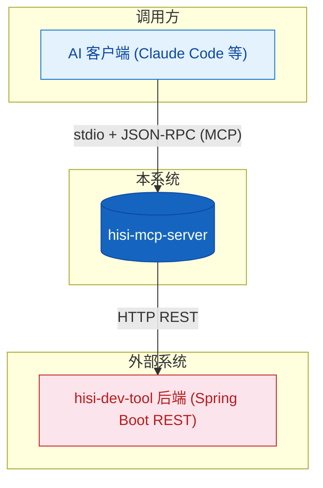
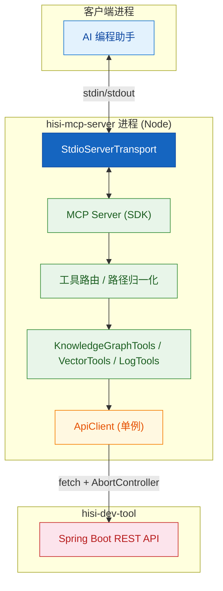
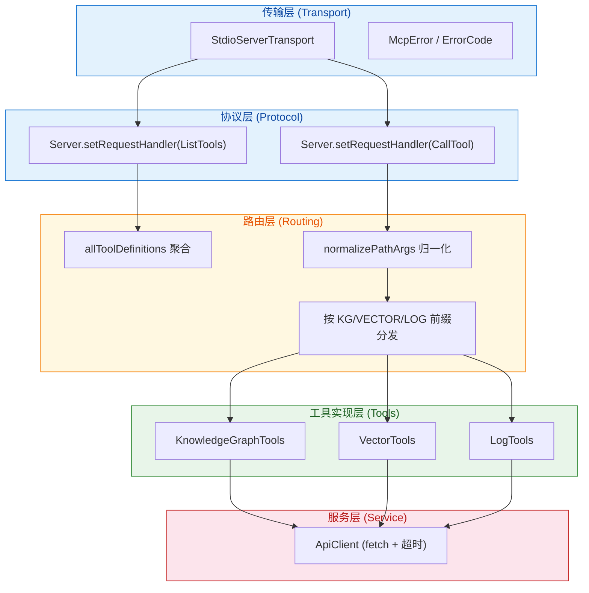
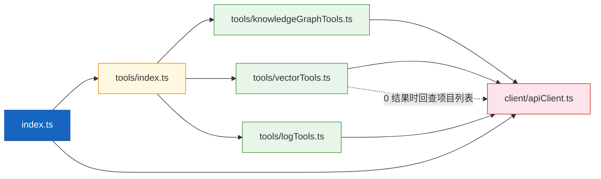
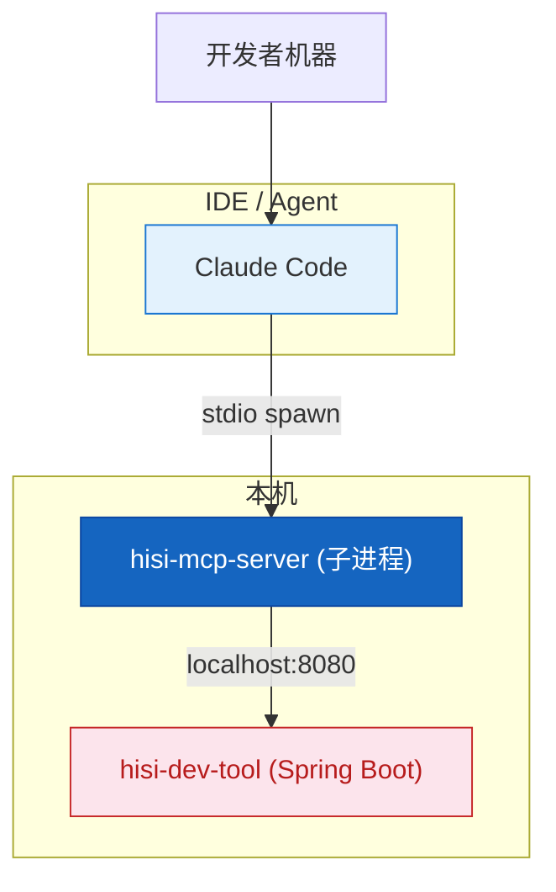

# 架构设计

---

## 1. 架构总览

### 1.1 系统上下文图(C4 Level 1)



**系统上下文说明**:

| 角色/系统 | 类型 | 交互方式 | 数据流向 |
|-----------|------|---------|---------|
| AI 客户端 | 程序 | stdio + JSON-RPC | 发送 ListTools / CallTool;接收工具结果 |
| hisi-dev-tool 后端 | 系统 | HTTP REST | 发送查询请求;接收 JSON 响应 |

### 1.2 容器图(C4 Level 2)



**容器说明**:

| 容器 | 技术 | 职责 | 通信端 |
|------|------|------|--------|
| StdioServerTransport | MCP SDK | stdio 上的 JSON-RPC 编解码 | stdin/stdout |
| MCP Server | MCP SDK | 注册 schema、分发请求 | 内部 |
| 工具路由 | 自研 | 按工具名前缀分发 + 路径归一化 | 内部 |
| 工具实现 | 自研 | 把入参转为后端 REST 调用 | 调用 ApiClient |
| ApiClient | 原生 fetch | HTTP 通信、超时、错误归一 | 后端 |

---

## 2. 分层设计

### 2.1 分层架构图



### 2.2 各层职责

#### 传输层 (Transport)

- **职责**:把 stdin/stdout 字节流封装为 MCP 帧。
- **核心组件**:`StdioServerTransport` (来自 SDK)。
- **设计约束**:除 stdout 外不可输出业务数据;调试日志一律走 stderr (`console.error`)。

#### 协议层 (Protocol)

- **职责**:注册 `ListToolsRequestSchema` 与 `CallToolRequestSchema` 处理器,统一错误响应格式。
- **核心组件**:`Server`、`McpError`、`ErrorCode.MethodNotFound`。

#### 路由层 (Routing)

- **职责**:聚合所有工具定义、路径归一化、按工具名分发。
- **核心组件**:`allToolDefinitions`、`handleToolCall`、`normalizePathArgs`。
- **设计约束**:工具名前缀决定归属(`kg_` / `hybrid_search` / `log_`),不可跨组复用。

#### 工具实现层 (Tools)

- **职责**:声明 inputSchema、把 LLM 入参转换为后端 REST 调用。
- **核心组件**:`KnowledgeGraphTools` / `VectorTools` / `LogTools`,均为无状态类。

#### 服务层 (Service)

- **职责**:统一 HTTP 通信(GET/POST/PUT/DELETE)、URL 拼接、超时控制、错误归一。
- **核心组件**:`ApiClient` 单例。

---

## 3. 模块依赖关系

### 3.1 依赖关系图



### 3.2 依赖规则

| 规则 | 说明 |
|------|------|
| **单向依赖** | 工具实现层只依赖 `ApiClient`,反向不允许 |
| **禁止状态共享** | 工具类不持有跨调用状态(每次 `handleToolCall` 新建实例) |
| **路径归一化集中** | 仅 `tools/index.ts` 的 `normalizePathArgs` 修改入参,其它层只读 |

### 3.3 共享模块

| 共享模块 | 使用者 | 说明 |
|---------|--------|------|
| `client/apiClient.ts` | 三类工具 | 单例 ApiClient + 类型 `ApiResponse<T>` |
| `tools/index.ts` 的类型导出 | 外部消费者 | 14 个 KG 入参类型 + Vector / Log 入参类型 |

---

## 4. 架构质量属性

### 4.1 优先级

| 优先级 | 质量属性 | 具体要求 | 架构保障 |
|--------|---------|---------|---------|
| P0 | 协议合规 | 严格遵守 MCP `tools/list` 与 `tools/call` 语义 | 使用官方 SDK,调试日志走 stderr |
| P0 | 错误透明 | 工具执行错误返回给 LLM 而非抛出 | `isError: true` + JSON 化 error 字段 |
| P1 | 可扩展性 | 新增一类工具不影响其它 | 三个工具文件 + `*_TOOLS` 列表前缀路由 |
| P1 | 健壮性 | 防止 stdio 阻塞、未捕获异常退出 | `uncaughtException` / `unhandledRejection` 钩子 |
| P2 | 跨平台 | Windows 路径分隔符兼容 | `normalizePathArgs` 自动 `\\` -> `/` |

### 4.2 架构权衡

| 权衡点 | 选择 | 放弃 | 理由 |
|--------|------|------|------|
| 传输方式 | stdio | HTTP/SSE | stdio 对 IDE 嵌入最简单,无需端口与鉴权 |
| HTTP 客户端 | 原生 fetch | axios | Node 18+ 自带,免依赖 |
| 工具组织 | 按能力域分文件 | 单文件大表 | 利于按域并行迭代 |
| 错误返回 | 工具内捕获 + isError | 全部 throw McpError | 让 LLM 看到错误文本以便自纠 |

---

## 5. 跨切面关注点

### 5.1 错误处理策略

```
传输/协议层:
  未知工具 -> throw McpError(MethodNotFound)
工具执行层:
  捕获普通 Error -> 返回 { content: [text(JSON)], isError: true }
ApiClient 层:
  HTTP 非 2xx -> throw new Error("HTTP <code>: <body>")
  超时        -> AbortController -> throw "Request timeout after Nms"
进程级:
  uncaughtException / unhandledRejection -> stderr + process.exit(1)
  SIGINT / SIGTERM                       -> 优雅 exit(0)
```

### 5.2 日志策略

| 层 | 触发 | 输出 | 格式 |
|----|------|------|------|
| 调试 | `HISI_DEBUG=true` | stderr | `[DEBUG] <event> <json>` |
| 错误 | 任意捕获到的 Error | stderr | `console.error(...)` |
| 业务结果 | 总是 | stdout (MCP 响应) | JSON-RPC |

> **铁律**:stdout 仅供 MCP JSON-RPC 使用,任何 `console.log` 都会破坏协议。本项目全部使用 `console.error`。

### 5.3 安全策略

| 关注点 | 策略 | 实现位置 |
|--------|------|---------|
| 入参校验 | JSON Schema 由 LLM/SDK 校验,Server 再做类型断言 | `inputSchema` 定义 |
| 路径注入 | `normalizePathArgs` 只做分隔符替换;后端做权限隔离 | `tools/index.ts` (引用) |
| 凭据 | 不持有任何密钥;`HISI_API_URL` 通过环境变量 | `index.ts` |
| 超时 | 默认 30s,防止悬挂 | `ApiClient.defaultTimeout` |

---

## 6. 部署架构

### 6.1 部署拓扑图



### 6.2 环境矩阵

| 环境 | 启动方 | 关键变量 | 说明 |
|------|------|---------|------|
| 开发 | `npm run dev` | `HISI_DEBUG=true`,`HISI_API_URL=http://localhost:8080` | tsc + node 一次性 |
| 集成 | MCP 客户端 spawn | 同上 | 由 IDE 拉起 |
| 生产 (个人电脑) | MCP 客户端 spawn | `HISI_API_URL` 指向部署后的后端 | 同上 |

---

## 7. 技术选型总结

| 领域 | 选择 | 备选 | 选择原因 | ADR |
|------|------|------|---------|-----|
| MCP 传输 | stdio | SSE / HTTP | 嵌入 IDE 零配置 | ADR-001 |
| 语言 | TypeScript strict | JavaScript | 工具 schema 类型同源 | ADR-002 |
| HTTP | 原生 fetch | axios / undici | Node 18+ 自带 | ADR-003 |
| ApiClient | 单例 | 每次新建 | 复用配置、减少 GC | ADR-004 |
| 错误返回 | isError + JSON | throw McpError | 让 LLM 可读可纠错 | ADR-005 |

详见 [08-技术决策](../08-技术决策/index.md)。

---

## 8. 架构约束

| 约束 | 影响 | 应对 |
|------|------|------|
| 必须 stdio,不可写 stdout 业务日志 | 任何 `console.log` 都会破坏 JSON-RPC | 调试统一 `console.error` |
| Node >= 18 | 依赖原生 fetch、AbortController | `engines.node` 限制 |
| 后端协议固定 | 后端接口路径变更需要同步改 `*Tools` | 后端联动 ADR |

---

> **延伸阅读**:
> - 模块详情 -> [03-模块说明](../03-模块说明/)
> - 数据流转 -> [04-数据流程](../04-数据流程/index.md)
> - 技术决策 -> [08-技术决策](../08-技术决策/index.md)
