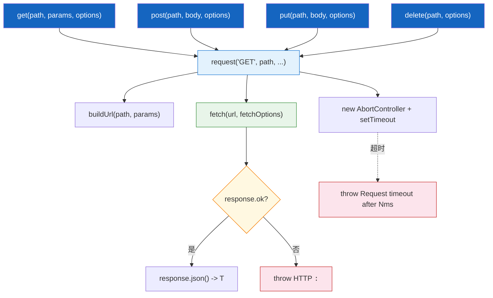

# API 客户端

| 属性 | 值 |
|------|-----|
| **所属层** | 服务层 |
| **目录** | `src/client/apiClient.ts` |
| **文件数** | 1 |
| **对外接口数** | `ApiClient` 类、`getApiClient(baseUrl?)`、`ApiResponse<T>`、`RequestOptions` |
| **依赖模块数** | 0 (使用 Node 18 原生 fetch / AbortController) |
| **被依赖数** | 4 (三类 Tools + 入口 index.ts) |

---

## 1. 模块概述

### 1.1 职责定义

**核心职责**:封装与 hisi-dev-tool Spring Boot 后端的 HTTP 通信,提供 GET/POST/PUT/DELETE 简单方法 + 超时 + 错误归一 + URL 拼接。

**职责边界**:

| 本模块负责 ✅ | 本模块不负责 ❌ | 由谁负责 |
|-------------|---------------|---------|
| URL 构造 (含 query) | 业务参数验证 | 工具层 |
| 超时(默认 30s) | 重试 | (无,目前不重试) |
| 错误归一 (`HTTP {status}: {body}`) | 错误展示 | 工具层 / Server |
| 单例缓存 | 鉴权 | (暂无) |

### 1.2 文件清单

| 文件 | 类型 | 职责 | 行数 |
|------|------|------|------|
| `src/client/apiClient.ts` | 服务/工具 | HTTP 封装 + 单例 | 159 |

---

## 2. 模块架构



---

## 3. 对外接口

### 3.1 类签名

```ts
export class ApiClient {
  constructor(baseUrl?: string);                       // 默认 http://localhost:8080,自动去掉末尾 /
  setBaseUrl(url: string): void;
  getBaseUrl(): string;
  get<T>(path, params?, options?): Promise<T>;
  post<T>(path, body, options?): Promise<T>;
  put<T>(path, body, options?): Promise<T>;
  delete<T>(path, options?): Promise<T>;
  healthCheck(): Promise<boolean>;                     // GET /api/health
}

export function getApiClient(baseUrl?: string): ApiClient;
```

### 3.2 共享类型

| 类型 | 用途 |
|------|------|
| `ApiResponse<T> { success, data?, error?, message? }` | 备用统一响应类型(目前后端各接口直接返回业务数据,未必使用此封装) |
| `RequestOptions { timeout?, headers? }` | 单次请求的超时和额外头 |

---

## 4. 内部实现要点

### 4.1 单例

```ts
let defaultClient: ApiClient | null = null;
export function getApiClient(baseUrl?: string): ApiClient {
  if (!defaultClient) defaultClient = new ApiClient(baseUrl);
  else if (baseUrl) defaultClient.setBaseUrl(baseUrl);
  return defaultClient;
}
```

第一次调用时创建,后续调用若提供 `baseUrl` 则更新现有实例的 baseUrl。

### 4.2 URL 构造

`buildUrl(path, params)` 用 `URL` 对象拼接 search params,跳过 `undefined` 与 `null`。

### 4.3 超时

```ts
const controller = new AbortController();
const timeoutId = setTimeout(() => controller.abort(), timeout);
// fetch(..., { signal: controller.signal })
// finally: clearTimeout(timeoutId)
```

`AbortError` 被翻译为更友好的 `Request timeout after Nms`。

### 4.4 错误归一

| 来源 | 抛出 |
|------|------|
| 非 2xx | `Error("HTTP <status>: <body>")` |
| AbortError | `Error("Request timeout after <ms>ms")` |
| 其它 Error | 原样 rethrow |
| 非 Error | `Error("Unknown error occurred")` |

### 4.5 healthCheck

`GET /api/health`,接受 `status === 'ok' || 'UP'` 视为健康;任何异常返回 `false`。

---

## 5. 依赖关系

无 npm 依赖。

| 下游消费者 | 用途 |
|-----------|------|
| `KnowledgeGraphTools` | 15 个 GET |
| `VectorTools` | 1 个 POST + 1 个回退 GET |
| `LogTools` | 2 GET + 2 POST |
| `src/index.ts` | `getApiClient(API_BASE_URL)` 触发初始化 |

---

## 6. 配置项

| 配置 | 来源 | 默认 |
|------|------|------|
| `baseUrl` | 构造参数或 `setBaseUrl` | `http://localhost:8080` |
| `defaultTimeout` | 私有字段(目前未暴露) | `30000` ms |

---

## 7. 错误处理

见 §4.4。所有错误都向上抛出,由调用方决定如何呈现。

---

## 8. 性能考量

| 关注点 | 策略 |
|--------|------|
| 连接 | 复用 Node 全局 fetch agent |
| 超时 | 强制 30s 上限 |
| 单例 | 避免每个工具调用都新建客户端 |

---

## 9. 已知问题与扩展点

| 项 | 说明 |
|----|------|
| 已知:无重试 | 网络抖动直接失败,LLM 需自行重试 |
| 已知:无并发限流 | LLM 大量并发调用可能压垮后端 |
| 扩展:鉴权 | 在 `request` 中追加 `Authorization` |
| 扩展:metrics | 在 try/finally 中加耗时统计 |

---

> **相关文档**:
> - 工具调用方式 -> [知识图谱工具](知识图谱工具.md)、[混合检索工具](混合检索工具.md)、[日志分析工具](日志分析工具.md)
> - 部署变量 -> [07-部署运维](../07-部署运维/index.md)
