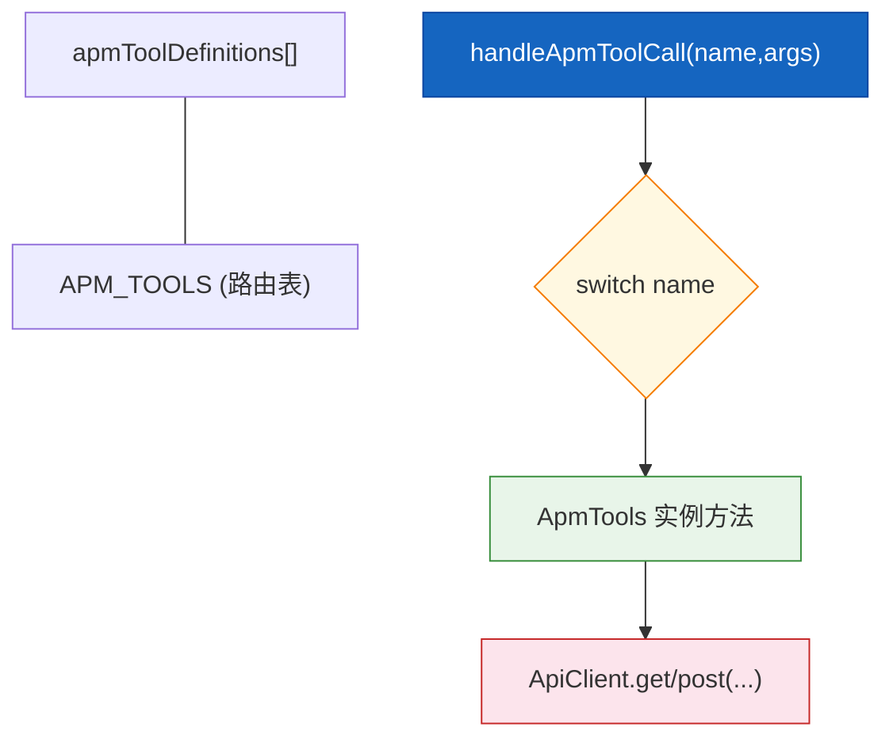
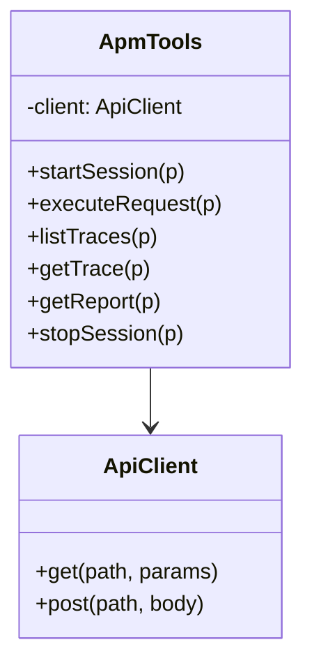
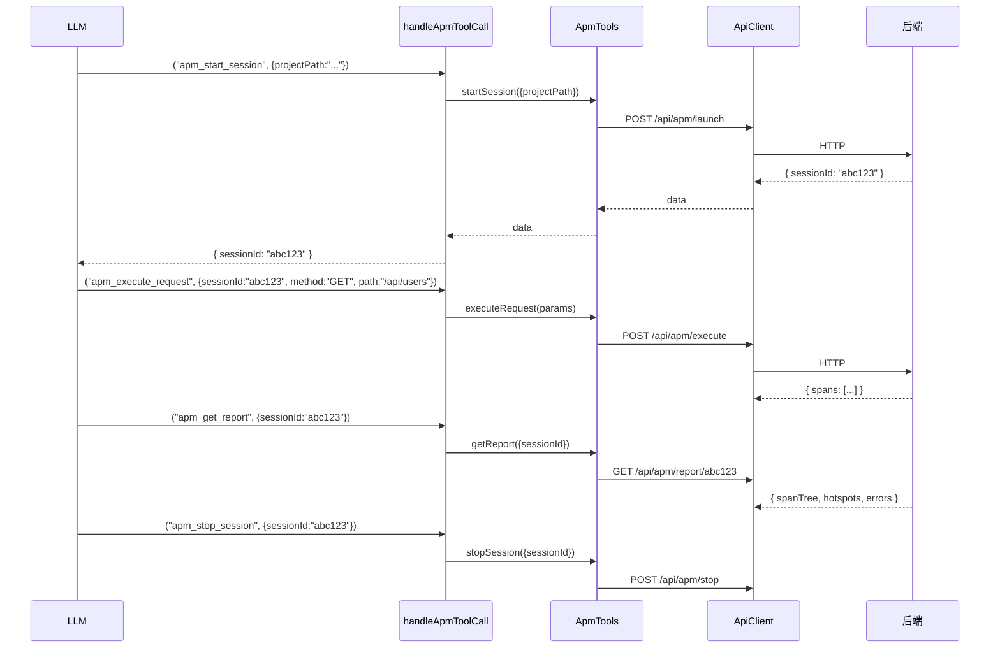

# APM 调试工具

| 属性 | 值 |
|------|-----|
| **所属层** | 工具层 |
| **目录** | `src/tools/apmTools.ts` |
| **文件数** | 1 |
| **对外接口数** | 6 个 MCP 工具 + `ApmTools` 类 + 6 个入参类型 |
| **依赖模块数** | 1 (`ApiClient`) |
| **被依赖数** | 1 (`tools/index.ts`) |

---

## 1. 模块概述

### 1.1 职责定义

**核心职责**:把后端 `ApmController` 的 APM 调试工作流接口包装为 MCP 工具,支持启动调试会话、执行 HTTP 请求、采集 Trace/Span、生成性能报告。

**职责边界**:

| 本模块负责 ✅ | 本模块不负责 ❌ | 由谁负责 |
|-------------|---------------|---------|
| inputSchema 声明 | OpenTelemetry Agent 注入 | 后端 |
| 会话状态流转 (start -> execute -> report -> stop) | Trace 采集与存储 | 后端 |
| 入参规范化 | 性能分析算法 | 后端 |

### 1.2 工具一览

| # | name | HTTP | 后端路径 | 必填 |
|---|------|------|---------|------|
| 1 | `apm_start_session` | POST | `/api/apm/launch` | `projectPath` |
| 2 | `apm_execute_request` | POST | `/api/apm/execute` | `sessionId`, `method`, `path` |
| 3 | `apm_list_traces` | GET | `/api/apm/spans/{sessionId}` | `sessionId` |
| 4 | `apm_get_trace` | GET | `/api/apm/trace/{traceId}` | `traceId` |
| 5 | `apm_get_report` | GET | `/api/apm/report/{sessionId}` | `sessionId` |
| 6 | `apm_stop_session` | POST | `/api/apm/stop` | `sessionId` |

> 完整 schema 见 [05-接口文档](../05-接口文档/index.md)。

---

## 2. 模块架构

### 2.1 内部结构图



### 2.2 类图



---

## 3. 内部实现要点

### 3.1 会话生命周期

```
apm_start_session (POST /api/apm/launch)
  -> sessionId
apm_execute_request (POST /api/apm/execute)  [可多次调用]
  -> Trace/Span 数据
apm_list_traces / apm_get_trace / apm_get_report
  -> 查询采集结果
apm_stop_session (POST /api/apm/stop)
  -> 清理
```

### 3.2 入参处理

- `startSession`: `projectPath` 必填;`targetPort` 和 `serviceName` 可选,仅在非 undefined 时放入 body
- `executeRequest`: 整个 params 对象直接作为 body 传递
- `listTraces` / `getTrace` / `getReport`: 路径参数直接拼接到 URL
- `stopSession`: 从 params 中提取 `sessionId` 包装为 `{ sessionId }` body

---

## 4. 交互流程

### 4.1 典型调用 (APM 调试全流程)



---

## 5. 依赖关系

| 上游 | 用途 |
|------|------|
| `../client/apiClient.js` | `ApiClient`、`getApiClient` |

| 下游 | 用途 |
|------|------|
| `tools/index.ts` | 聚合定义、路由 |

---

## 6. 错误处理

| 场景 | 行为 |
|------|------|
| 后端 4xx/5xx | `ApiClient.request` 抛出 `HTTP <code>: <body>` |
| 超时 (>30s) | 抛 `Request timeout after 30000ms` |
| 工具内 `default` 分支 | `throw Error("Unknown APM tool")` |

错误统一被 `src/index.ts` 的 CallTool 捕获,转为 `{ isError:true, content:[text(JSON)] }`。

---

## 7. 扩展点

| 扩展 | 做法 |
|------|------|
| 新增 APM 工具 | 在 `apmToolDefinitions` 加定义 + `ApmTools` 加方法 + `APM_TOOLS` 数组加名 + `switch` 加分支 |
| 支持更多 HTTP 方法 | 修改 `apm_execute_request` 的 `method` enum |

---

> **相关文档**:
> - 全量 schema -> [05-接口文档](../05-接口文档/index.md)
> - 入参类型 -> [06-数据模型](../06-数据模型/index.md)
> - HTTP 通信 -> [API客户端](API客户端.md)
