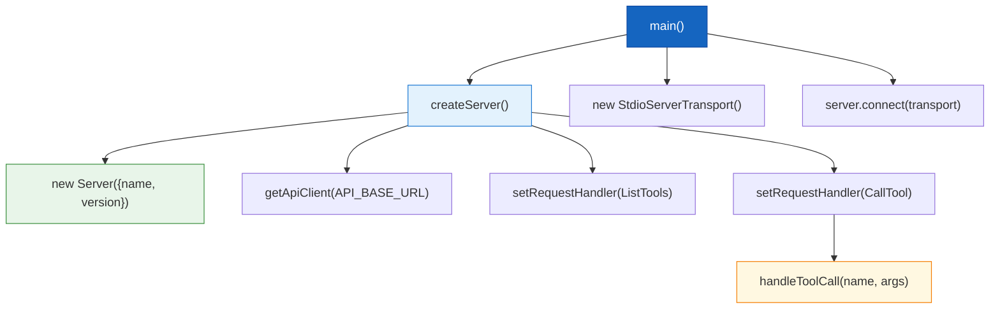
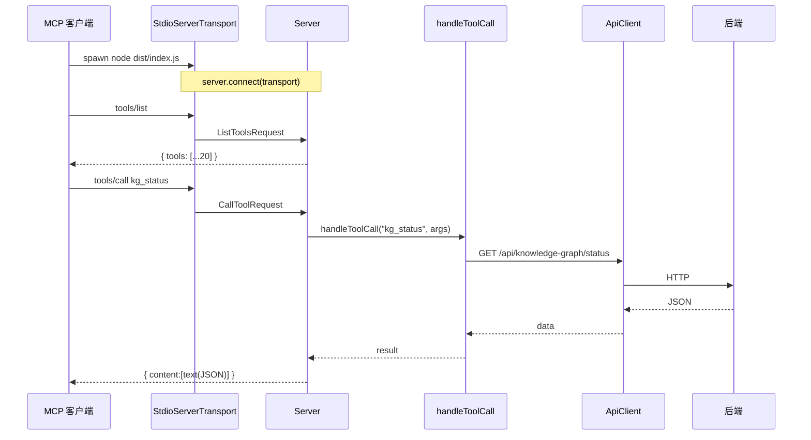
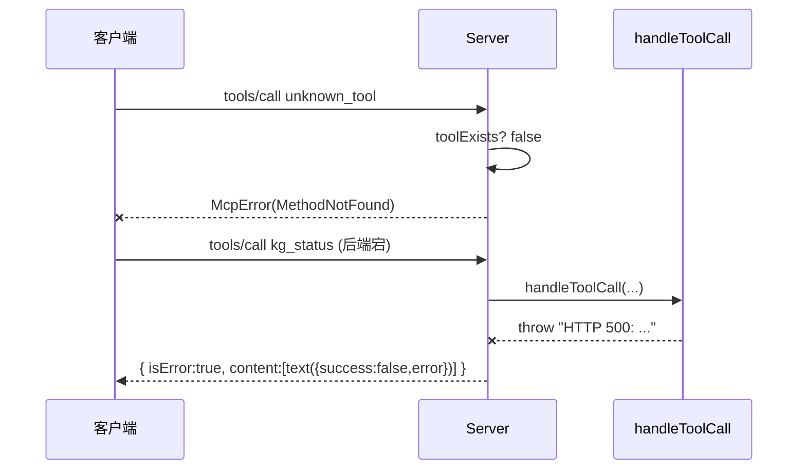

# MCP 服务入口

| 属性 | 值 |
|------|-----|
| **所属层** | 传输层 / 协议层 |
| **目录** | `src/index.ts` |
| **文件数** | 1 |
| **对外接口数** | 0 (CLI 入口,通过 stdio 暴露 MCP 协议) |
| **依赖模块数** | 2 (`tools/index`、`client/apiClient`) |
| **被依赖数** | 0 (顶层入口) |

---

## 1. 模块概述

### 1.1 职责定义

**核心职责**:创建 MCP `Server` 实例、注册 `ListTools` / `CallTool` 处理器、绑定 `StdioServerTransport`、处理生命周期事件 (SIGINT/SIGTERM/uncaughtException)。

**职责边界**:

| 本模块负责 ✅ | 本模块不负责 ❌ | 由谁负责 |
|-------------|---------------|---------|
| Server 创建与连接 | 工具入参 schema 定义 | `tools/*ToolDefinitions` |
| 请求 -> 工具调用分发 | 工具具体实现 | `KnowledgeGraphTools` 等 |
| 调试日志 (stderr) | 业务错误格式化 | 工具实现层 |
| 进程信号与异常兜底 | HTTP 通信 | `ApiClient` |

### 1.2 核心文件清单

| 文件 | 类型 | 职责 | 行数 |
|------|------|------|------|
| `src/index.ts` | CLI 入口 | Server 装配 + main() | 183 |

---

## 2. 模块架构

### 2.1 内部结构图



---

## 3. 对外接口

无导出符号,通过 `package.json` `bin` / `main` 作为可执行 Node 脚本被启动。

启动行为:

| 行为 | 说明 |
|------|------|
| 读取 `HISI_API_URL` (默认 `http://localhost:8080`) | 初始化 ApiClient |
| 读取 `HISI_DEBUG` (`'true'` 时启用调试日志) | 控制 stderr 调试输出 |
| 连接 stdio | `StdioServerTransport` |

---

## 4. 内部实现

### 4.1 关键常量

| 常量 | 值 | 来源 |
|------|----|------|
| `SERVER_NAME` | `'hisi-mcp-server'` | 硬编码 |
| `SERVER_VERSION` | `'1.0.0'` | 硬编码 |
| `API_BASE_URL` | `process.env.HISI_API_URL || 'http://localhost:8080'` | 环境变量 |
| `DEBUG` | `process.env.HISI_DEBUG === 'true'` | 环境变量 |

### 4.2 ListTools 处理

```ts
return {
  tools: allToolDefinitions.map(t => ({
    name: t.name,
    description: t.description,
    inputSchema: t.inputSchema,
  })),
};
```

### 4.3 CallTool 处理流程

1. 校验 `name` 在 `allToolDefinitions` 中
2. 不存在 -> `throw new McpError(ErrorCode.MethodNotFound, ...)`
3. 存在 -> `await handleToolCall(name, args || {})`
4. 成功 -> `{ content: [{ type: 'text', text: JSON.stringify(result) }] }`
5. 失败 -> `{ content: [{ type: 'text', text: JSON.stringify({success:false, error, tool:name}) }], isError: true }`

> 仅 `MethodNotFound` 会以 `McpError` 抛出;业务错误一律包装为 `isError: true` 的工具结果,让 LLM 可读可重试。

---

## 5. 交互流程

### 5.1 启动 + 一次工具调用



### 5.2 异常路径



---

## 6. 依赖关系

### 6.1 上游依赖

| 依赖 | 交互方式 | 接口 |
|------|---------|------|
| `@modelcontextprotocol/sdk/server/index.js` | import | `Server` |
| `@modelcontextprotocol/sdk/server/stdio.js` | import | `StdioServerTransport` |
| `@modelcontextprotocol/sdk/types.js` | import | `CallToolRequestSchema`, `ListToolsRequestSchema`, `ErrorCode`, `McpError` |
| `./tools/index.js` | import | `allToolDefinitions`, `handleToolCall` |
| `./client/apiClient.js` | import | `getApiClient` |

### 6.2 下游消费者

无 (顶层入口)。

---

## 7. 配置项

| 配置 | 类型 | 默认值 | 环境变量 | 说明 |
|------|------|--------|---------|------|
| API Base URL | string | `http://localhost:8080` | `HISI_API_URL` | 后端地址 |
| Debug 日志 | boolean | `false` | `HISI_DEBUG` | `true` 启用 stderr 调试 |

---

## 8. 错误处理

| 场景 | 处理 | 客户端感知 |
|------|------|-----------|
| 未知工具名 | `McpError(MethodNotFound)` | JSON-RPC 错误 |
| 工具内部错误 | 包装为 `isError:true` | LLM 看到错误 JSON 文本 |
| `server.connect` 失败 | `console.error` + `process.exit(1)` | 子进程退出 |
| `uncaughtException` | `console.error` + `exit(1)` | 子进程退出,客户端可重启 |
| `unhandledRejection` | `console.error` + `exit(1)` | 同上 |
| `SIGINT` / `SIGTERM` | 立即 `exit(0)` | 正常关闭 |

---

## 9. 性能考量

| 关注点 | 策略 |
|--------|------|
| 启动开销 | 模块级 import,无额外 IO |
| 调试日志 | 仅在 `DEBUG=true` 时执行 `JSON.stringify` |
| 单例 ApiClient | 复用 base URL 与默认 timeout |

---

## 10. 测试策略

当前无自动化测试,建议:

| 测试类型 | 关键用例 |
|---------|---------|
| 协议级 | 启动后发送 `tools/list`,断言返回 20 项 |
| E2E | 调用 `kg_list_projects` 验证后端连通 |

---

## 11. 已知问题与扩展点

| 项 | 说明 |
|----|------|
| 已知:启动失败时 `server.connect` 抛出后,后续 try-catch 仍执行 `process.exit(1)`,但 `process.on('uncaughtException')` 同样会退出 | 影响小,行为一致 |
| 扩展点:可注册更多 schema (Prompts/Resources) 到 Server | 修改 `createServer()` |
| 扩展点:支持多传输 (SSE/HTTP) | 在 `main()` 选择不同 Transport |

---

> **相关文档**:
> - 架构总览 -> [02-架构设计](../02-架构设计/index.md)
> - 工具路由 -> [工具路由聚合](工具路由聚合.md)
> - 数据流 -> [04-数据流程](../04-数据流程/index.md)
