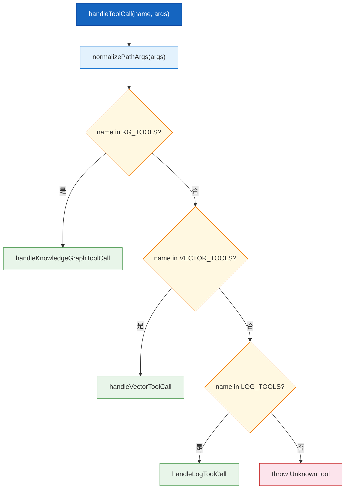
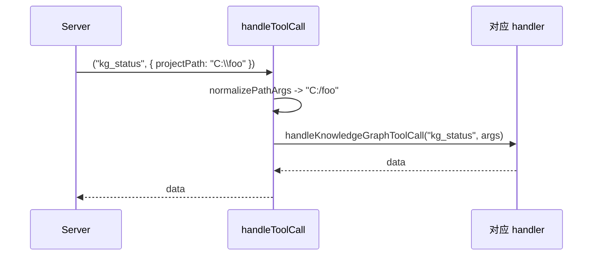

# 工具路由聚合

| 属性 | 值 |
|------|-----|
| **所属层** | 应用层 / 路由层 |
| **目录** | `src/tools/index.ts` |
| **文件数** | 1 |
| **对外接口数** | `allToolDefinitions`、`handleToolCall` + 各组类型再导出 |
| **依赖模块数** | 3 (`knowledgeGraphTools`、`vectorTools`、`logTools`) + 1 工具 (`utils/pathUtils`) |
| **被依赖数** | 1 (`src/index.ts`) |

---

## 1. 模块概述

### 1.1 职责定义

**核心职责**:聚合所有工具定义、统一入参路径归一化、按工具名前缀分发到对应处理器。

**职责边界**:

| 本模块负责 ✅ | 本模块不负责 ❌ | 由谁负责 |
|-------------|---------------|---------|
| 聚合 `allToolDefinitions` | 单个工具的 schema 定义 | 各 `*ToolDefinitions` |
| 路径归一化 (`\` -> `/`) | 业务参数校验 | 各工具 handler |
| 按 `KG_TOOLS` / `VECTOR_TOOLS` / `LOG_TOOLS` 分发 | HTTP 通信 | `ApiClient` |

### 1.2 核心文件清单

| 文件 | 类型 | 职责 | 行数 |
|------|------|------|------|
| `src/tools/index.ts` | barrel + 路由 | 聚合 + 分发 | 90 |

---

## 2. 模块架构

### 2.1 内部结构图



---

## 3. 对外接口

| 接口 | 类型 | 说明 |
|------|------|------|
| `allToolDefinitions` | `ToolDefinition[]` | 20 个工具定义聚合数组 |
| `handleToolCall(name, args)` | `Promise<unknown>` | 统一调度入口 |
| 各 `KgXxxParams` / `HybridSearchParams` / `LogXxxParams` | type | 入参类型再导出 |

### 3.1 `handleToolCall` 签名

```ts
export async function handleToolCall(
  toolName: string,
  args: Record<string, unknown>
): Promise<unknown>;
```

| 步骤 | 说明 |
|------|------|
| 1 | `args = normalizePathArgs(args)` (Windows `\\` -> `/`) |
| 2 | 在 `KG_TOOLS` / `VECTOR_TOOLS` / `LOG_TOOLS` 任一列表命中 -> 转交对应 handler |
| 3 | 全未命中 -> `throw new Error("Unknown tool: ...")` |

---

## 4. 内部实现

### 4.1 工具表(节选)

| 列表 | 长度 | 工具名 |
|------|------|--------|
| `KG_TOOLS` | 15 | `kg_list_projects`、`kg_status`、`kg_method_detail`、`kg_method_by_class`、`kg_entry_points`、`kg_downstream`、`kg_affecting`、`kg_bridges`、`kg_bridge_stats`、`kg_implementations`、`kg_mybatis_sql`、`kg_feign_chain`、`kg_mq_chain`、`kg_root_entries`、`kg_callees_tree` |
| `VECTOR_TOOLS` | 1 | `hybrid_search` |
| `LOG_TOOLS` | 4 | `log_query`、`log_analyze`、`log_report`、`log_report_status` |

### 4.2 路径归一化

引用自 `../utils/pathUtils.js` 的 `normalizePathArgs`,将入参中所有 `string` 字段中的反斜杠替换为正斜杠,以兼容 Windows 用户提交的 `C:\projects\foo` 路径。

> 该工具文件在源码树中实际未出现 (`src/utils/` 缺失);构建产物 `dist/utils/pathUtils.js` 应当存在。如运行时报 `Cannot find module`,需要补充 `src/utils/pathUtils.ts`。

---

## 5. 交互流程



---

## 6. 依赖关系

| 上游 | 用途 |
|------|------|
| `./knowledgeGraphTools.js` | 15 个 KG 工具 |
| `./vectorTools.js` | hybrid_search |
| `./logTools.js` | 4 个 log 工具 |
| `../utils/pathUtils.js` | 路径归一化 |

| 下游 | 使用 |
|------|------|
| `src/index.ts` | `allToolDefinitions`、`handleToolCall` |

---

## 7. 错误处理

| 场景 | 行为 |
|------|------|
| 未知工具 | `throw Error("Unknown tool: <name>")` -> 由 `index.ts` 捕获并以 `isError:true` 返回 |

---

## 8. 扩展点

| 扩展 | 做法 |
|------|------|
| 新增一组工具 (e.g. `db_*`) | 新建 `dbTools.ts`,导出 `dbToolDefinitions` + `DB_TOOLS` + `handleDbToolCall`;在本文件 import 并加分支 |
| 修改路径归一化策略 | 替换 `normalizePathArgs` 实现 |

---

> **相关文档**:
> - 入口模块 -> [MCP服务入口](MCP服务入口.md)
> - 知识图谱工具详解 -> [知识图谱工具](知识图谱工具.md)
> - 接口完整 schema -> [05-接口文档](../05-接口文档/index.md)
