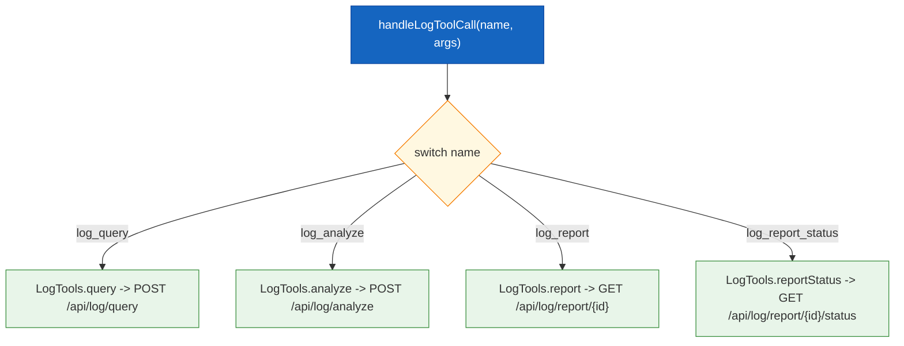
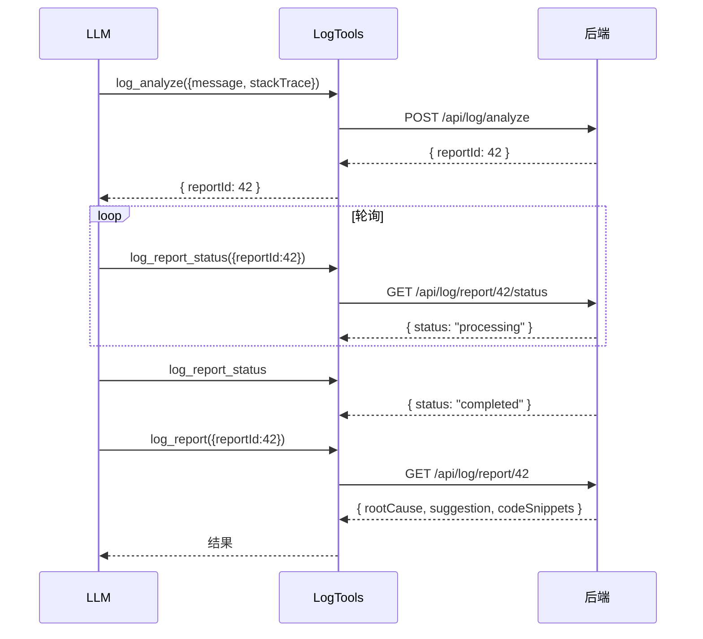

# 日志分析工具

| 属性 | 值 |
|------|-----|
| **所属层** | 工具层 |
| **目录** | `src/tools/logTools.ts` |
| **文件数** | 1 |
| **对外接口数** | 4 个 MCP 工具 + `LogTools` 类 + 3 个入参类型 |
| **依赖模块数** | 1 (`ApiClient`) |
| **被依赖数** | 1 (`tools/index.ts`) |

---

## 1. 模块概述

### 1.1 职责定义

**核心职责**:把后端 `LogAnalysisController` 的查询、提交分析、查询报告状态、获取报告四个接口包装为 MCP 工具。

**工具一览**:

| # | name | HTTP | 路径 | 必填 |
|---|------|------|------|------|
| 1 | `log_query` | POST | `/api/log/query` | (无,全部可选) |
| 2 | `log_analyze` | POST | `/api/log/analyze` | `message` 或 `stackTrace` 至少一个 |
| 3 | `log_report` | GET | `/api/log/report/{reportId}` | `reportId` |
| 4 | `log_report_status` | GET | `/api/log/report/{reportId}/status` | `reportId` |

> Schema 详情见 [05-接口文档](../05-接口文档/index.md)。

---

## 2. 内部结构



---

## 3. 异步分析的工作流



---

## 4. 关键实现要点

### 4.1 `query` 入参清洗

`LogTools.query` 只把**已定义**的字段塞进 body,未传的字段不会出现在 JSON,以避免后端把 `undefined` 当作 `null` 误处理:

```ts
if (params.keyword !== undefined) body.keyword = params.keyword;
if (params.logLevel !== undefined) body.logLevel = params.logLevel;
// ... 同样模式
```

### 4.2 `dslQuery` 优先级

后端 DTO 注释 (源码注释中) 表明 `dslQuery` 优先级最高,设置后会覆盖其它过滤;本层不做校验,直接透传。

### 4.3 `errorOnly` 默认行为

后端默认 `true`(只返回错误日志);LLM 想查 INFO/WARN 必须显式 `errorOnly: false`。

---

## 5. 依赖关系

| 上游 | 用途 |
|------|------|
| `../client/apiClient.js` | HTTP |

| 下游 | 用途 |
|------|------|
| `tools/index.ts` | 路由 |

---

## 6. 错误处理

| 场景 | 行为 |
|------|------|
| `log_analyze` 同时缺 `message` 和 `stackTrace` | inputSchema `required:[]` 不强制,后端会拒绝并返回 4xx |
| `reportId` 不存在 | 后端 4xx -> `ApiClient` 抛错 -> Server 转 isError |

---

## 7. 扩展点

| 扩展 | 做法 |
|------|------|
| 新增异步分析类型 | 复用 analyze + report + status 三段式 |
| 增加分页 | 后端先支持 `from/size`,本层加字段透传 |

---

> **相关文档**:
> - 接口 schema -> [05-接口文档](../05-接口文档/index.md)
> - 入参类型 -> [06-数据模型](../06-数据模型/index.md)
