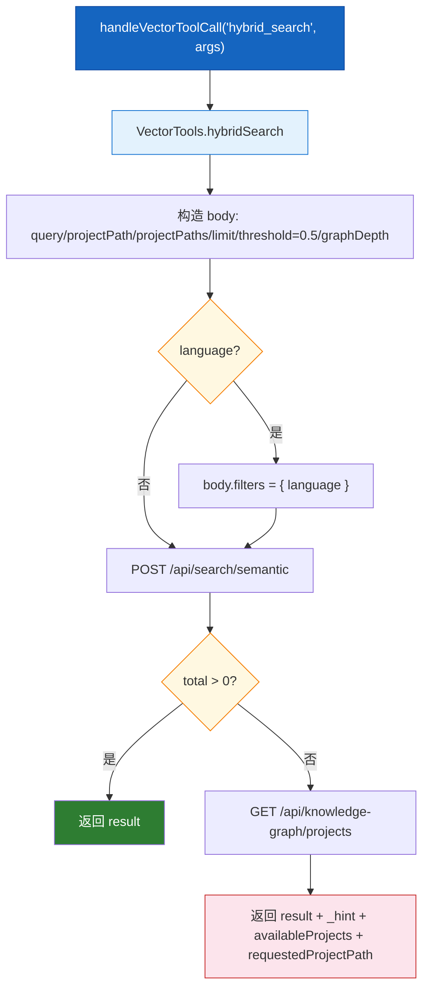
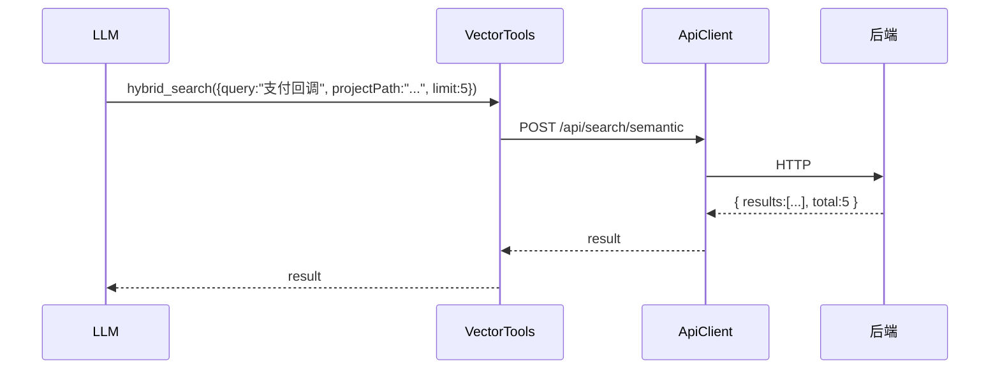
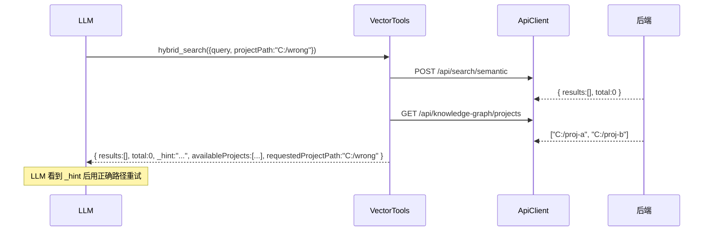

# 混合检索工具

| 属性 | 值 |
|------|-----|
| **所属层** | 工具层 |
| **目录** | `src/tools/vectorTools.ts` |
| **文件数** | 1 |
| **对外接口数** | 1 个 MCP 工具 (`hybrid_search`) + `VectorTools` 类 + `HybridSearchParams` |
| **依赖模块数** | 1 (`ApiClient`) |
| **被依赖数** | 1 (`tools/index.ts`) |

---

## 1. 模块概述

### 1.1 职责定义

**核心职责**:把后端三层混合检索接口 (`POST /api/search/semantic`) 包装为 MCP 工具,自然语言 -> 方法列表;0 结果时自动附带项目列表用于纠错。

**职责边界**:

| 本模块负责 ✅ | 本模块不负责 ❌ | 由谁负责 |
|-------------|---------------|---------|
| 入参规范化 (`projectPath`/`projectPaths` 互填) | 关键词/向量/图遍历算法 | 后端 |
| 默认值 (`limit=10`, `threshold=0.5`, `graphDepth=0`) | 阈值调优 | 后端 |
| 0 结果时回查 `availableProjects` | 项目建图 | 后端 |

---

## 2. 工具定义

| 字段 | 值 |
|------|----|
| **name** | `hybrid_search` |
| **HTTP** | `POST /api/search/semantic` |
| **必填** | `query` |
| **可选** | `projectPath`、`projectPaths`、`limit`、`graphDepth`、`language` |

完整 schema 见 [05-接口文档](../05-接口文档/index.md#hybrid_search)。

---

## 3. 内部架构



---

## 4. 关键实现细节

### 4.1 默认值

| 字段 | 默认 |
|------|------|
| `limit` | `10` |
| `threshold` | `0.5` (硬编码,不暴露给 LLM) |
| `graphDepth` | `0` (仅向量,不做图遍历扩展) |
| `language` filter | 不传 -> 不过滤 |

### 4.2 0 结果回退

```ts
const total = Array.isArray(result?.results)
  ? result.results.length
  : (result?.total ?? 0);

if (!total) {
  const availableProjects = await client.get('/api/knowledge-graph/projects');
  return { ...result, _hint, availableProjects, requestedProjectPath };
}
```

`_hint` 文案告诉 LLM:可能 `projectPath` 不在已建图项目中,请在 `availableProjects` 中选一个重试。

### 4.3 错误吞咽

回查 `availableProjects` 失败时静默忽略,返回原始空结果以保证主流程不中断。

---

## 5. 交互流程

### 5.1 命中



### 5.2 未命中(自动回退)



---

## 6. 依赖关系

| 上游 | 用途 |
|------|------|
| `../client/apiClient.js` | HTTP |

| 下游 | 用途 |
|------|------|
| `tools/index.ts` | 路由 |

---

## 7. 错误处理

| 场景 | 行为 |
|------|------|
| 后端 5xx | 抛 `HTTP 5xx: ...` |
| 回查项目列表失败 | 静默忽略,返回原始空结果 |

---

## 8. 扩展点

| 扩展 | 做法 |
|------|------|
| 暴露 `threshold` 给 LLM | 在 inputSchema 加字段并把硬编码改为入参 |
| 默认开启图遍历 | 修改 `graphDepth ?? 0` 默认值 |

---

> **相关文档**:
> - 接口 schema -> [05-接口文档](../05-接口文档/index.md)
> - 与 KG 的协作 -> [知识图谱工具](知识图谱工具.md)
