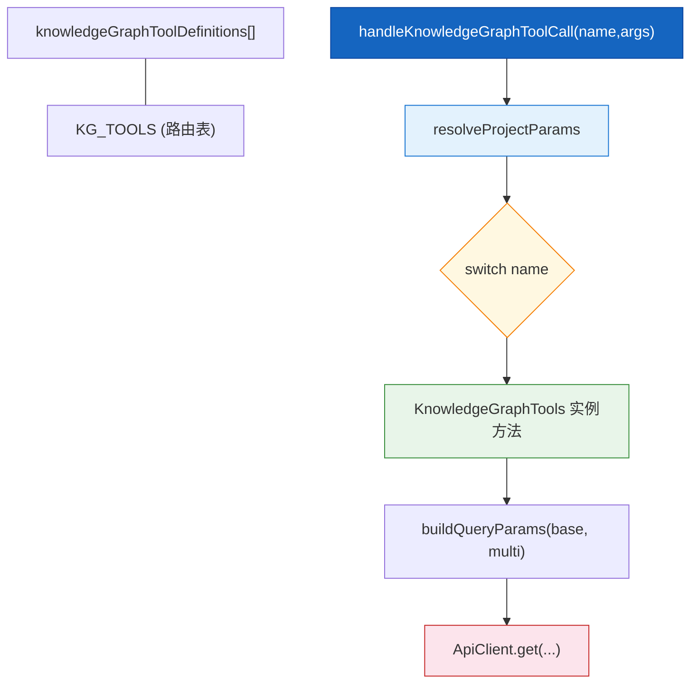
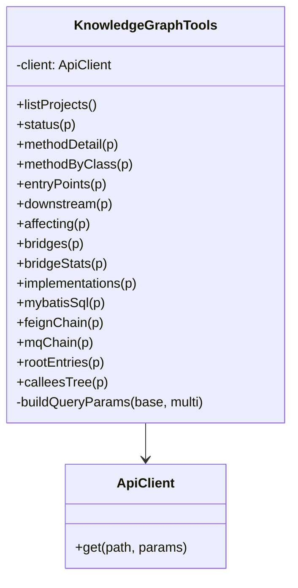
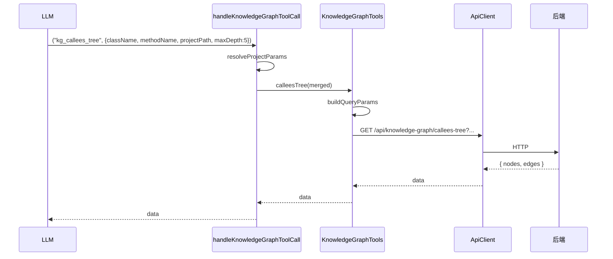

# 知识图谱工具

| 属性 | 值 |
|------|-----|
| **所属层** | 工具层 |
| **目录** | `src/tools/knowledgeGraphTools.ts` |
| **文件数** | 1 |
| **对外接口数** | 15 个 MCP 工具 + `KnowledgeGraphTools` 类 + 14 个入参类型 |
| **依赖模块数** | 1 (`ApiClient`) |
| **被依赖数** | 1 (`tools/index.ts`) |

---

## 1. 模块概述

### 1.1 职责定义

**核心职责**:把后端 `/api/knowledge-graph/*` 的 15 个 REST 接口包装为 MCP 工具,声明 inputSchema、转换入参为 query string、调用 `ApiClient`。

**职责边界**:

| 本模块负责 ✅ | 本模块不负责 ❌ | 由谁负责 |
|-------------|---------------|---------|
| inputSchema 声明 | 知识图谱构建 | 后端 |
| 多项目入参合并 (`projectPath` <-> `projectPaths`) | 路径分隔符归一化 | `tools/index.ts` |
| URL 编码 (Feign / MQ topic) | HTTP 重试 | (无,目前不重试) |

### 1.2 工具一览

| # | name | HTTP | 后端路径 | 必填 |
|---|------|------|---------|------|
| 1 | `kg_list_projects` | GET | `/api/knowledge-graph/projects` | - |
| 2 | `kg_status` | GET | `/api/knowledge-graph/status` | `projectPath` |
| 3 | `kg_method_detail` | GET | `/api/knowledge-graph/method/detail` | `nodeId`, `projectPath` |
| 4 | `kg_method_by_class` | GET | `/api/knowledge-graph/method/by-class` | `className`, `projectPath` |
| 5 | `kg_entry_points` | GET | `/api/knowledge-graph/entry-points` | `projectPath` |
| 6 | `kg_downstream` | GET | `/api/knowledge-graph/call-chain/downstream` | `nodeId`, `projectPath` |
| 7 | `kg_affecting` | GET | `/api/knowledge-graph/call-chain/affecting` | `className`, `methodName`, `projectPath` |
| 8 | `kg_bridges` | GET | `/api/knowledge-graph/call-chain/{nodeId}/bridges` | `nodeId`, `projectPath` |
| 9 | `kg_bridge_stats` | GET | `/api/knowledge-graph/bridge-stats` | `projectPath` |
| 10 | `kg_implementations` | GET | `/api/knowledge-graph/implementations` | `interfaceName`, `projectPath` |
| 11 | `kg_mybatis_sql` | GET | `/api/knowledge-graph/mybatis/sql` | `projectPath` |
| 12 | `kg_feign_chain` | GET | `/api/knowledge-graph/feign/{serviceName}/call-chain` | `serviceName`, `projectPath` |
| 13 | `kg_mq_chain` | GET | `/api/knowledge-graph/mq/{topic}/call-chain` | `topic`, `projectPath` |
| 14 | `kg_root_entries` | GET | `/api/knowledge-graph/root-entries` | `className`, `methodName`, `projectPath` |
| 15 | `kg_callees_tree` | GET | `/api/knowledge-graph/callees-tree` | `className`, `methodName`, `projectPath` |

> 完整 schema 见 [05-接口文档](../05-接口文档/index.md)。

---

## 2. 模块架构

### 2.1 内部结构图



### 2.2 类图



---

## 3. 内部实现要点

### 3.1 多项目参数解析 (`resolveProjectParams`)

| 入参 | 行为 |
|------|------|
| `projectPath` | 兜底用作 `projectPaths[0]` |
| `projectPaths` | 优先;若空,用 `[projectPath]` 包装 |
| `language` | 透传 (`'java'` / `'python'`) |

### 3.2 公共可选 schema (`commonOptionalProperties`)

每个工具自动注入:

```ts
projectPaths: { type: 'array', items: { type: 'string' } }
language:     { type: 'string', enum: ['java', 'python'] }
```

### 3.3 Query 构建

`buildQueryParams(base, multi)`:

- 把 `projectPaths` 用逗号 join 后塞进 query
- 把 `language` 透传

### 3.4 特殊路径处理

- `kg_bridges`:nodeId 拼到 path,`/api/knowledge-graph/call-chain/{nodeId}/bridges`
- `kg_feign_chain`、`kg_mq_chain`:服务名 / topic 用 `encodeURIComponent` 转义
- `kg_entry_points`:当 `entryType === 'ALL'` 时不传该参数 (后端默认 ALL)

---

## 4. 交互流程

### 4.1 典型调用 (kg_callees_tree)



### 4.2 0 结果时的提示

KG 工具本身不做 0 结果重试;LLM 应根据后端返回提示自行二次调用 `kg_list_projects` 修正 `projectPath`。`hybrid_search` 在 0 结果时会自动附带 `availableProjects` (见混合检索工具)。

---

## 5. 依赖关系

| 上游 | 用途 |
|------|------|
| `../client/apiClient.js` | `ApiClient`、`getApiClient` |

| 下游 | 用途 |
|------|------|
| `tools/index.ts` | 聚合定义、路由 |

---

## 6. 错误处理

| 场景 | 行为 |
|------|------|
| 后端 4xx/5xx | `ApiClient.request` 抛出 `HTTP <code>: <body>` |
| 超时 (>30s) | 抛 `Request timeout after 30000ms` |
| 工具内 `default` 分支 | `throw Error("Unknown knowledge graph tool")` |

错误统一被 `src/index.ts` 的 CallTool 捕获,转为 `{ isError:true, content:[text(JSON)] }`。

---

## 7. 扩展点

| 扩展 | 做法 |
|------|------|
| 新增 KG 工具 | 在 `knowledgeGraphToolDefinitions` 加定义 + `KnowledgeGraphTools` 加方法 + `KG_TOOLS` 数组加名 + `switch` 加分支 |
| 默认开启某 language | 修改 `resolveProjectParams` 的兜底 |

---

> **相关文档**:
> - 全量 schema -> [05-接口文档](../05-接口文档/index.md)
> - 入参类型 -> [06-数据模型](../06-数据模型/index.md)
> - HTTP 通信 -> [API客户端](API客户端.md)
