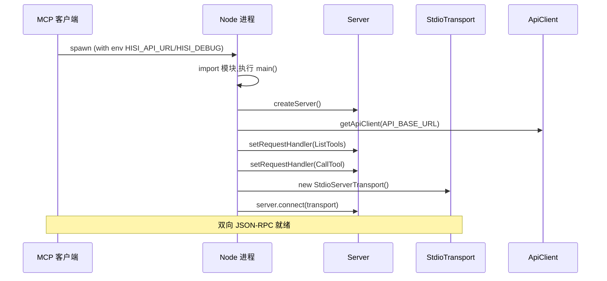
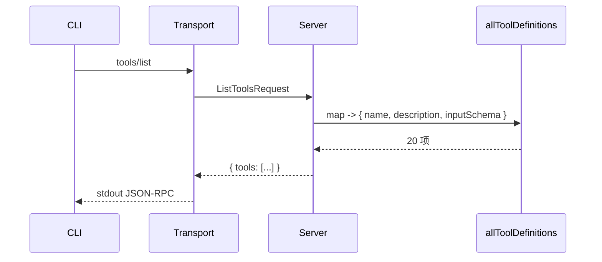
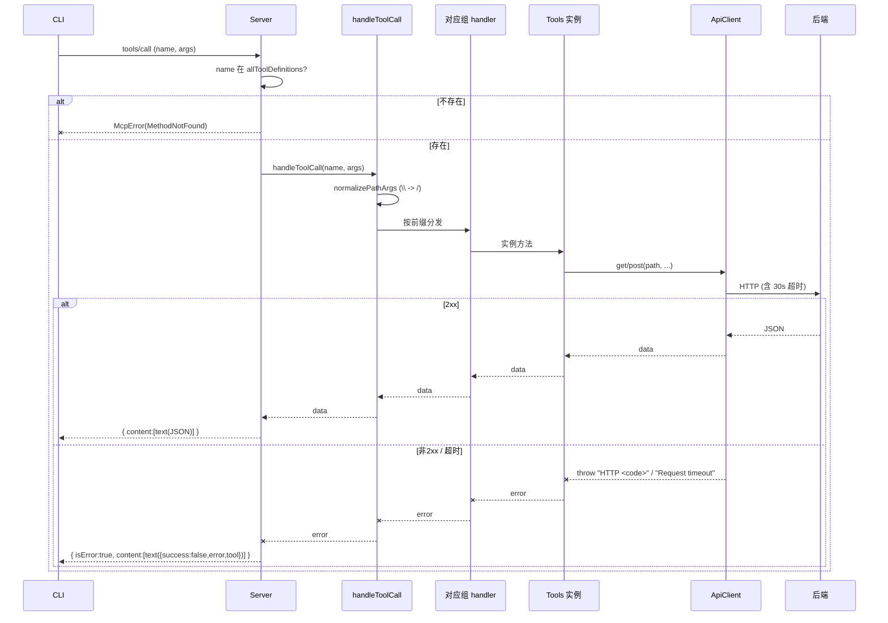
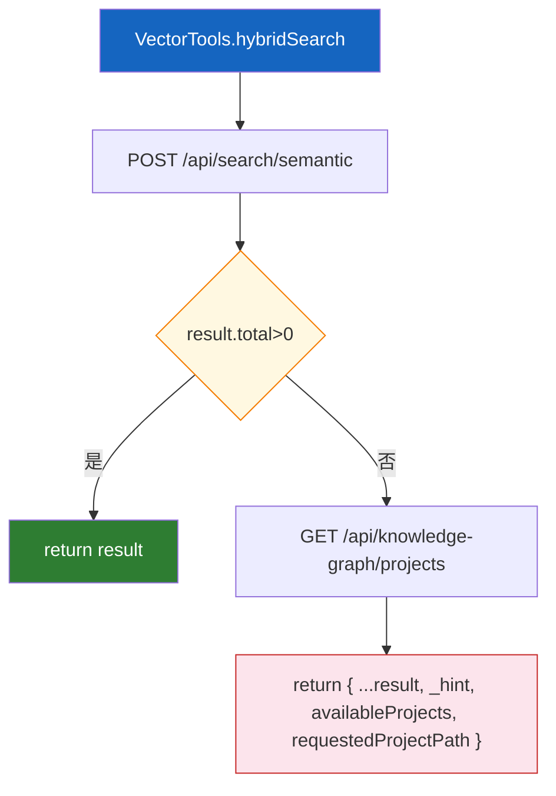
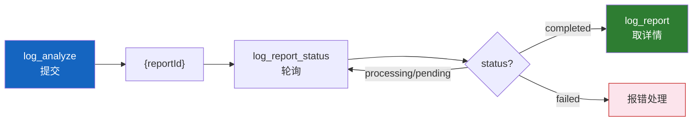

# 数据流程

> 本文聚焦 hisi-mcp-server 中 **MCP 请求的端到端流转**:从 AI 客户端发出 `tools/call`,经 stdio + SDK + 路由 + 工具实现 + ApiClient,最终到达后端并把结果回吐。

---

## 1. 端到端数据流总览

```mermaid
flowchart LR
    AI["AI 客户端"]
    subgraph Server["hisi-mcp-server"]
        ST["StdioServerTransport"]
        SDK["MCP Server"]
        RT["handleToolCall + normalizePathArgs"]
        T["KG/Vector/Log Tools"]
        AC["ApiClient (fetch)"]
    end
    BE["hisi-dev-tool 后端"]

    AI -->|"1.tools/call (stdin)"| ST
    ST --> SDK
    SDK -->|"2.dispatch"| RT
    RT -->|"3.normalize+route"| T
    T -->|"4.HTTP"| AC
    AC -->|"5.GET/POST"| BE
    BE -.->|"6.JSON"| AC
    AC -.->|"7.parsed"| T
    T -.->|"8.unknown"| RT
    RT -.->|"9.return"| SDK
    SDK -.->|"10.text(JSON)"| ST
    ST -.->|"11.stdout"| AI

    style AI fill:#1565c0,color:#fff,stroke:#0d47a1
    style ST fill:#e3f2fd,stroke:#1976d2
    style SDK fill:#e3f2fd,stroke:#1976d2
    style RT fill:#fff8e1,stroke:#f57c00
    style T fill:#e8f5e9,stroke:#388e3c
    style AC fill:#e8f5e9,stroke:#388e3c
    style BE fill:#fce4ec,stroke:#c62828
```

---

## 2. 启动流

---

## 3. ListTools 流程

---

## 4. CallTool 流程(含错误分支)

---

## 5. 关键工具的数据形态

### 5.1 hybrid_search(0 结果回退)

### 5.2 log_analyze 异步报告(三段式)

---

## 6. 横切数据(调试日志)

| 触发 | 字段 | 输出位置 |
|------|------|---------|
| `HISI_DEBUG=true` + ListTools 请求 | `[DEBUG] ListTools request received` | stderr |
| `HISI_DEBUG=true` + CallTool | `[DEBUG] CallTool request: <name> <argsJSON>` | stderr |
| 工具结果 | `[DEBUG] Tool result: <json>` | stderr |
| 工具异常 | `[DEBUG] Error: <message>` + Error | stderr |

> stdout 永远只承载 MCP JSON-RPC 报文,不可写业务日志。

---

## 7. 数据规范化点

| 步骤 | 字段 | 处理 |
|------|------|------|
| 路由层 | 任意字符串字段 | `\` -> `/` (`normalizePathArgs`) |
| KG 工具层 | `projectPath` / `projectPaths` | 互相回填(任一存在即可) |
| KG 工具层 | `entryType === 'ALL'` | 不传该参数 |
| Vector 工具层 | `limit` / `graphDepth` | 缺省 10 / 0 |
| Vector 工具层 | `threshold` | 硬编码 0.5,不暴露 |
| Log 工具层 | 任意 undefined 字段 | 不放入 body |

---

> **延伸阅读**:
> - 协议层细节 -> [MCP服务入口](../03-模块说明/MCP服务入口.md)
> - 路由实现 -> [工具路由聚合](../03-模块说明/工具路由聚合.md)
> - HTTP 细节 -> [API客户端](../03-模块说明/API客户端.md)
