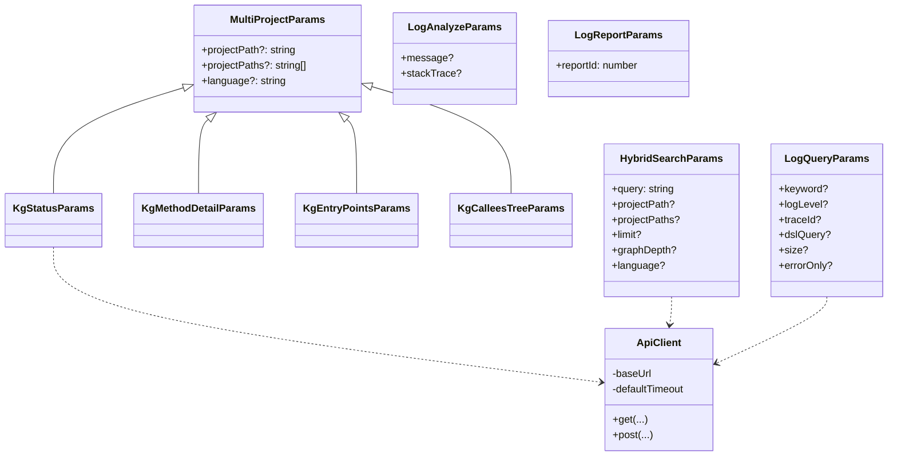

# 数据模型

> 本服务**不持有业务数据模型**(数据结构由后端定义)。本文档汇总:工具入参类型、HTTP 通信类型、错误结果结构。

---

## 1. MCP 协议层类型(来自 SDK)

| 类型 | 出处 | 用途 |
|------|------|------|
| `Server` | `@modelcontextprotocol/sdk/server/index.js` | MCP 服务实例 |
| `StdioServerTransport` | `@modelcontextprotocol/sdk/server/stdio.js` | stdio 传输 |
| `ListToolsRequestSchema` | SDK types | 列工具请求 |
| `CallToolRequestSchema` | SDK types | 调用工具请求 |
| `McpError`, `ErrorCode` | SDK types | 协议错误 |

工具响应统一形态:

```ts
{
  content: [ { type: 'text', text: string } ],
  isError?: boolean
}
```

---

## 2. 工具定义类型

```ts
type ToolDefinition = {
  name: string;
  description: string;
  inputSchema: {
    type: 'object';
    properties: Record<string, JSONSchema>;
    required: string[];
  };
};
```

聚合数组:`allToolDefinitions: ToolDefinition[]` (长度 20)。

---

## 3. 工具入参类型(导出)

### 3.1 知识图谱组(14 个,`kg_list_projects` 无入参)

```ts
interface MultiProjectParams {
  projectPath?: string;
  projectPaths?: string[];
  language?: 'java' | 'python' | string;
}

interface KgStatusParams         extends MultiProjectParams { projectPath: string; }
interface KgMethodDetailParams   extends MultiProjectParams { nodeId: string; projectPath: string; }
interface KgMethodByClassParams  extends MultiProjectParams { className: string; projectPath: string; }
interface KgEntryPointsParams    extends MultiProjectParams { projectPath: string;
  entryType?: 'CONTROLLER'|'SCHEDULED'|'MQ_LISTENER'|'FEIGN_CLIENT'|'ALL'; }
interface KgDownstreamParams     extends MultiProjectParams { nodeId: string; projectPath: string; maxDepth?: number; }
interface KgAffectingParams      extends MultiProjectParams { className: string; methodName: string; projectPath: string; }
interface KgBridgesParams        extends MultiProjectParams { nodeId: string; projectPath: string; }
interface KgBridgeStatsParams    extends MultiProjectParams { projectPath: string; }
interface KgImplementationsParams extends MultiProjectParams { interfaceName: string; projectPath: string; }
interface KgMybatisSqlParams     extends MultiProjectParams { projectPath: string;
  mapperInterface?: string;
  statementType?: 'SELECT'|'INSERT'|'UPDATE'|'DELETE'; }
interface KgFeignChainParams     extends MultiProjectParams { serviceName: string; projectPath: string; }
interface KgMqChainParams        extends MultiProjectParams { topic: string; projectPath: string; }
interface KgRootEntriesParams    extends MultiProjectParams { className: string; methodName: string; projectPath: string; }
interface KgCalleesTreeParams    extends MultiProjectParams { className: string; methodName: string; projectPath: string; maxDepth?: number; }
```

### 3.2 混合检索

```ts
interface HybridSearchParams {
  query: string;
  projectPath?: string;
  projectPaths?: string[];
  limit?: number;       // 默认 10
  graphDepth?: number;  // 默认 0
  language?: 'java' | 'python';
}
```

### 3.3 日志组

```ts
interface LogQueryParams {
  keyword?: string;
  logLevel?: 'ERROR' | 'WARN' | 'INFO' | 'DEBUG';
  appId?: string;
  traceId?: string;
  contentContains?: string;
  dslQuery?: string;       // 优先级最高
  startTime?: string;      // ISO
  endTime?: string;        // ISO
  size?: number;           // 默认 100, 最大 1000
  errorOnly?: boolean;     // 默认 true
  sortOrder?: 'asc' | 'desc'; // 默认 desc
}

interface LogAnalyzeParams {
  message?: string;
  stackTrace?: string;
  serviceName?: string;
  traceId?: string;
  errorType?: string;
}

interface LogReportParams {
  reportId: number;
}
```

---

## 4. 通信层类型

```ts
interface ApiResponse<T> {
  success: boolean;
  data?: T;
  error?: string;
  message?: string;
}

interface RequestOptions {
  timeout?: number;       // ms,默认 30000
  headers?: Record<string, string>;
}
```

> `ApiResponse<T>` 是预留信封;当前后端各接口直接返回业务 JSON,工具层未做统一展开。

---

## 5. 错误结果结构

```ts
// 工具内捕获的非 McpError -> 包装为
{
  success: false;
  error: string;     // 例如 "HTTP 500: Internal..." 或 "Request timeout after 30000ms"
  tool: string;      // 工具名
}
```

包装位置:`src/index.ts` 的 CallTool handler。

---

## 6. 类型关系图



---

> **延伸阅读**:
> - 完整 schema -> [05-接口文档](../05-接口文档/index.md)
> - 工具实现 -> [03-模块说明](../03-模块说明/)
