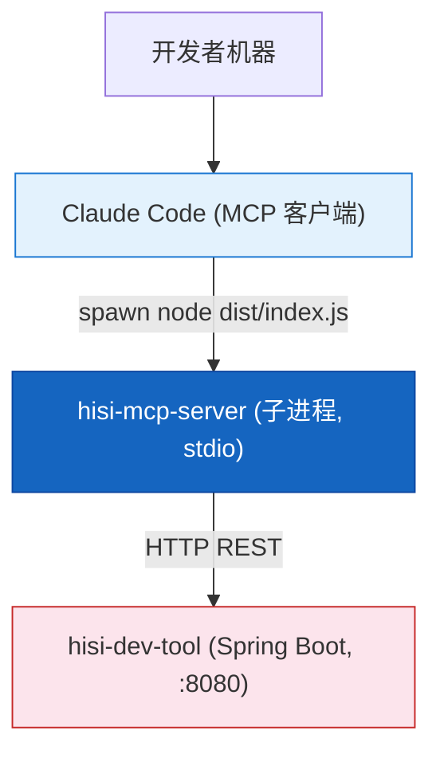

# 部署运维

---

## 1. 构建产物

| 项 | 说明 |
|----|------|
| 命令 | `npm run build` (= `tsc`) |
| 输入 | `src/**/*.ts` |
| 输出 | `dist/**/*.js` + `*.d.ts` + `*.js.map` |
| 入口 | `dist/index.js`(`package.json.main`) |
| Node | `>=18.0.0`(原生 fetch / AbortController) |
| 模块 | ESM (`"type": "module"`,NodeNext) |

```bash
cd hisi-mcp-server
npm install
npm run build
node dist/index.js   # 直接运行(等待 stdio 输入)
```

---

## 2. 环境变量

| 变量 | 默认 | 必需 | 说明 |
|------|------|------|------|
| `HISI_API_URL` | `http://localhost:8080` | 否 | hisi-dev-tool Spring Boot 后端地址,末尾不带 `/` |
| `HISI_DEBUG` | (空) | 否 | 设为字符串 `'true'` 时开启 stderr 调试日志 |

> 本服务不读取 `.env` 文件;如需,请在拉起本服务的 MCP 客户端配置中通过 `env` 字段注入。

---

## 3. MCP 客户端注册示例

### 3.1 Claude Desktop / Claude Code (`claude_desktop_config.json`)

```json
{
  "mcpServers": {
    "hisi-mcp-server": {
      "command": "node",
      "args": ["C:/Users/<you>/projects/hisi_dev_tool v5.0/hisi-mcp-server/dist/index.js"],
      "env": {
        "HISI_API_URL": "http://localhost:8080",
        "HISI_DEBUG": "false"
      }
    }
  }
}
```

### 3.2 全局 npm 安装(可选)

当前 `package.json` 未声明 `bin` 字段,如需 `hisi-mcp-server` 命令,建议补充:

```json
"bin": { "hisi-mcp-server": "dist/index.js" }
```

并在 `dist/index.js` 顶部保留 `#!/usr/bin/env node`(源码已有)。

---

## 4. 部署拓扑



---

## 5. 健康检查

`ApiClient.healthCheck()` 调 `GET ${HISI_API_URL}/api/health`,接受 `status === 'ok' || 'UP'`。当前未在启动时主动调用,可在排查时手工:

```bash
curl $HISI_API_URL/api/health
```

---

## 6. 日志与监控

| 渠道 | 内容 |
|------|------|
| stdout | **仅** MCP JSON-RPC 报文(不可写日志) |
| stderr | 调试与错误日志;客户端通常会捕获并展示 |
| 客户端日志目录 | 视 MCP 客户端而定(Claude Desktop 通常在 `~/Library/Logs/Claude` 或 `%APPDATA%\Claude\logs`) |

启用调试:在 MCP 配置 `env` 中加 `"HISI_DEBUG": "true"`,然后查看客户端的 MCP 日志即可看到 `[DEBUG]` 行。

---

## 7. 优雅关闭

| 信号 | 行为 |
|------|------|
| `SIGINT` | `process.exit(0)` |
| `SIGTERM` | `process.exit(0)` |
| `uncaughtException` | `console.error` + `exit(1)` |
| `unhandledRejection` | `console.error` + `exit(1)` |

无内部状态,直接退出无副作用;客户端通常会自动重启。

---

## 8. 升级与版本兼容

| 维度 | 当前 | 升级注意 |
|------|------|---------|
| MCP SDK | `^1.0.0` | 升级前检查 `Server` / `*RequestSchema` 是否仍向后兼容 |
| Node | `>=18` | 不要降到 16(无原生 fetch) |
| 后端接口 | 紧耦合 `/api/knowledge-graph/*` 等路径 | 后端路径变更需要同步修改 `*Tools.ts` |

---

## 9. 故障排查清单

| 现象 | 排查 |
|------|------|
| 客户端拿不到工具列表 | 检查 `command`/`args` 路径正确;`node --version` >= 18 |
| 所有工具返回 `Request timeout` | 后端未启动 / 网络隔离;`curl $HISI_API_URL/api/health` |
| 所有 KG 工具返回 0 | `projectPath` 不在 `kg_list_projects` 结果中 |
| `hybrid_search` 返回带 `_hint` | 同上;按 `availableProjects` 重试 |
| stdout 出现非 JSON 字符 -> 客户端解析失败 | 代码中误用 `console.log`;统一改 `console.error` |

---

> **延伸阅读**:
> - 入口实现 -> [MCP服务入口](../03-模块说明/MCP服务入口.md)
> - HTTP 客户端 -> [API客户端](../03-模块说明/API客户端.md)
