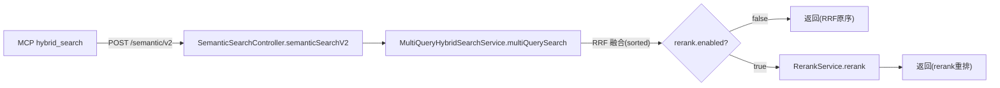

# 语义检索 rerank：技术实施计划

## 已批准目标与约束
- 目标：MCP `hybrid_search` 走 v2 端点 + 移除两个历史 v1 端点 + 新增可配置（默认关）的外部 rerank 精排。
- 非目标：不换 embedding 模型；不建评测集；不改 QueryDecomposer；不动服务层 `hybridSearch` 方法签名与内部调用方；不改 KG 生成侧。
- 风险/闸门：Standard / medium（公开 REST API 移除 breaking，但影响面已全仓界定）。

## 已刷新代码事实
| 结论 | 证据 | 新鲜度 |
|---|---|---|
| rerank 挂载点 = multiQuerySearch 主路径 `sorted`(153-156) 之后、`SearchResult.builder()`(200-212) 之前 | `MultiQueryHybridSearchService.java:153-212` | 当前 |
| multiQuerySearch 有 3 个返回路径（单查询退化 45-51 / 全部失败 74-80 / 主路径 200-212） | `MultiQueryHybridSearchService.java` | 当前 |
| MCP 打到 v1 `/api/search/semantic`，且 threshold 是死参数 | `vectorTools.ts:102`、`SemanticSearchController.java:68` vs `:123` | 当前 |
| HTTP 客户端 = RestTemplate（`proxyConfig.getCurrentRestTemplate()`） | `UnifiedEmbeddingService.java:109-110` | 当前 |
| 配置绑定模式 = `@ConfigurationProperties(prefix="search")` | `SearchIntentProperties.java:17` | 当前 |
| MethodNode 有 description/methodBody/signature/className/methodName | `MethodNode.java:38-128` | 当前 |
| G8：另一 active change `kg-build-mode-selector` 只碰 KG 生成侧，无路径重叠 | `openspec list` + 其 proposal.md | 当前 |

## 技术决策清单
| ID | 待决事项 | 决策归属 | 实质影响 | 选项与建议 | 状态 | 最终结论与记录 |
|---|---|---|---|---|---|---|
| D1 | MCP threshold 死参数 | 用户 | 对外契约 | A 删除（推荐） | decided | 删除 threshold（本次不新增能力） |
| D2 | MCP subQueries/rrfScores 透传 | 用户 | 对外契约 | A 原样透传（推荐） | decided | 原样透传 |
| D3 | rerank documents 文本 | 用户 | 精度 | A description（推荐） | decided | description，null 降级签名 |
| D4 | rerank 重排后分数处理 | 用户 | 返回语义 | A 更新 similarityScore、留 rrfScores（推荐） | decided | 见上 |
| D5 | rerank 作用范围 | 用户 | 改动面 | A 只主路径（推荐） | decided | 只主路径 |
| D6 | rerank 配置属性组织 | 用户 | 代码结构 | A 独立 RerankProperties（推荐） | decided | 独立 RerankProperties(prefix=search.rerank) |
| D7 | rerank HTTP 客户端 | Agent | 实现细节 | 复用 proxyConfig RestTemplate | decided | 复用 proxyConfig.getCurrentRestTemplate()（代理支持） |

## 方案比较

### 方案 A：新增独立 RerankService + RerankProperties（选定）
- 方案形态：新建 `RerankProperties`（`@ConfigurationProperties(prefix="search.rerank")`，字段 enabled/baseUrl/model/apiKey）+ `RerankService`（`@Service`，用 RestTemplate POST `/rerank`）。`MultiQueryHybridSearchService` 注入两者，在主路径 `sorted` 之后、build 之前调用 `rerankService.rerank(query, fusedResults)` 重排。
- 收益：语义清晰、敏感项隔离、复用现有 HTTP 模式、开关默认关零回归。
- 成本/风险：新增 2 个类 + 1 处挂载改动。
- 可逆性：完全可逆（`enabled=false` 即历史逻辑）。
- 验证方式：`enabled=false` 输出与现状逐位一致；`enabled=true` 顺序随 rerank 分变化。

### 方案 B：塞进 SearchIntentProperties + 内联 HTTP
- 方案形态：在 SearchIntentProperties 加嵌套 Rerank 类，rerank HTTP 直接写在 MultiQueryHybridSearchService 内。
- 收益：少一个类。
- 成本/风险：语义混淆（精排配置混进意图权重）、服务类膨胀。
- 可逆性：可逆。
- 验证方式：同上。

## 最终决策
- 选定方案：A（独立 RerankService + RerankProperties）。
- 选择理由：高内聚、敏感项隔离、复用已有 RestTemplate 代理模式。
- 未选方案及原因：B 语义混淆、服务类膨胀，违背单一职责。
- 决策来源 / 批准记录：grilling 共识 + 用户「确认」（D1-D6 均为用户拍板，D7 为 Agent 决策）。

## 集成方式与数据流/控制流

- rerank 请求：`POST {baseUrl}/rerank`，body `{model, query, documents:[description...]}`；响应 `{results:[{index, relevance_score}]}`。
- 重排：按 relevance_score 降序重排 fusedResults/fusedItems；`similarityScore` 更新为 rerank 分；`rrfScores` 保持 RRF 原值。

## 接口与状态模型
- `RerankProperties`：`enabled`(boolean, false)、`baseUrl`(String)、`model`(String)、`apiKey`(String)。
- `RerankService.rerank(String query, List<MethodNode> candidates)` → `Map<String, Double>`（nodeId → rerank 分）。
- 无状态（每次检索独立调用）。

## 失败处理与可观测性
- rerank 端点调用失败/超时/非 200 → 捕获异常，log.warn，返回空 Map → 上层按 RRF 原序返回（降级，不中断检索）。
- 日志：`[Rerank] enabled/model/costMs/top-K`（脱敏，不打印 apiKey）。

## 兼容、迁移与回滚
- 兼容：`enabled=false`（默认）输出与现状逐位一致；`/v2` 端点返回结构不变（仍含 subQueries/rrfScores）。
- 迁移：无数据迁移（纯代码 + 配置）。
- 回滚：`application.yml` 将 `enabled` 置 false 即回滚。

## 安全与性能
- 安全：apiKey 走 `application.yml` 环境变量占位（`${RERANK_API_KEY:}`），不硬编码；日志脱敏。
- 性能：rerank 仅主路径 top-K 一次调用；`enabled=false` 时零额外开销。

## 验证策略
- 单元测试：`RerankService` 用 Mock RestTemplate 验证请求/降级/重排逻辑。
- 回归：`MultiQueryHybridSearchService` 测试锁定 `enabled=false` 时主路径输出不变。
- 控制器：v1 端点 404（已删）、v2 端点正常。
- MCP：端点 URL 断言为 `/semantic/v2`、threshold 从 schema 移除。
- 命令：`cd hisi-dev-tool && mvn test`；MCP `npx tsc --noEmit`。

## 需求追溯
| 需求/场景 | 设计要素 | 任务 | 验证 |
|---|---|---|---|
| rerank 外部 API 配置（默认关） | RerankProperties | T4 | 单元测试 + 配置绑定 |
| 召回后 rerank 精排 | RerankService + 主路径挂载 | T3 | 单元测试 + 回归 |
| 关闭时零回归 | enabled=false 分支 | T3 | MultiQueryHybridSearchService 回归 |
| rerank 异常降级 | 捕获+空 Map | T3 | 单元测试 |
| MCP 走 v2 端点 | vectorTools.ts URL | T1 | 端点断言 |
| 历史端点移除 | 删 v1 方法 | T2 | 404 断言 |
| v2 端点不受影响 | 保留 searchV2/semanticSearchV2 | T2 | 回归 |

## 已知风险与非目标
- 已知风险：rerank 外部端点响应格式需实施时用真实/示例响应验证（bge-reranker 标准格式）。
- 非目标：单查询退化路径 rerank（D5）；threshold 能力（D1）；前端死代码删除（无物可删）。
