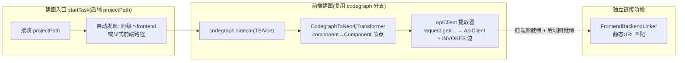

# 前端代码实体化 + 前后端跨层关系：技术实施计划

## 已批准目标与约束
- 目标：前端代码（Vue/TS）成为图谱一等实体（Component/FrontendRoute/ApiClient + 前端内部边），并用静态 URL 匹配构建「前端 API 调用点 → 后端 EntryPoint」的跨层 INVOKES_API 边。
- 非目标：不建手动拖拽编辑器；不重写 JavaParser/codegraph 核心；不引入新图数据库；不落地 OpenAPI 契约关联与运行时链路追踪。
- 风险/闸门：High（命中公共契约扩展 + Neo4j schema 新增 + 跨三层模块 + 核心建图流水线扩展）；实现闸门单题放行 + 代价/风险/回滚摘要。

## 已刷新代码事实
| 结论 | 证据 | 新鲜度 |
|---|---|---|
| codegraph sidecar 节点 kind 仅 function/method/component/route/class/interface/file/module/namespace，无 HTTP 调用点语义 | `CodegraphToNeo4jTransformer.java:86-155` | 新鲜（当前 HEAD） |
| 前端 component/route 被抹平为后端 Method | `CodegraphToNeo4jTransformer.java:87-104` | 新鲜 |
| codegraph 分支仅由 TYPESCRIPT/JAVASCRIPT 触发，cleanOldData + sidecar + transformer 一体 | `KnowledgeGraphBuilder.java:263-268,334-353` | 新鲜 |
| 后端 EntryPoint 已提取完整 HTTP 路径 `entryKey = METHOD fullPath`（含 /api 前缀） | `KnowledgeGraphBuilder.java:1714-1718` | 新鲜 |
| 前端 axios 统一 `baseURL: '/api'`，URL 65 字面量 + 67 模板（均 `${var}` 路径参数型，可归一化），fetch 仅 2 处 | `request.ts:27-38` + grep 统计 | 新鲜 |
| 后端路径参数 `{var}` 与前端 `${var}` 同构，归一化规则清晰 | `KnowledgeGraphController.java:1835` 等 | 新鲜 |
| cleanProjectData 按 projectPath 精确删，前端实际目录作 projectPath 天然隔离 | `Neo4jStorageService.java:520-568` | 新鲜 |
| MCP language 枚举仅 java/python | `knowledgeGraphTools.ts:44-46` | 新鲜 |
| 建图入口 startTask 单 projectPath + 单语言分派 | `KnowledgeGraphController.java:120-138` | 新鲜 |

## 技术决策清单
| ID | 待决事项 | 决策归属 | 实质影响 | 选项与建议 | 状态 | 最终结论与记录 |
|---|---|---|---|---|---|---|
| D1 | 前端实体化复用 codegraph 分支 vs 新建独立流水线 | 用户 | 工程量和架构形态 | A 复用（改 transformer 映射 + 补 ApiClient 解析器）；B 新建独立流水线 | decided | A 复用 codegraph 分支（用户 2026-08-20 确认） |
| D2 | ApiClient 提取技术栈 | Agent | 实现细节（已由 grilling 定 TS 侧 sidecar） | TS sidecar 用 @vue/compiler-sfc + @babel/parser | decided | 复用 codegraph sidecar 的 Node 环境，新增「api-call 提取」子命令 |
| D3 | 前端项目 projectPath 值 | Agent（已 grilling 定） | 隔离正确性 | 前端实际目录 | decided | 前端实际目录 |
| D4 | 跨层链接触发方式 | Agent | 交互设计 | 独立链接阶段，前后端就绪后重跑；后端重建后需重跑 | decided | 独立 FrontendBackendLinker |

## 方案比较
### 方案 A：复用 codegraph 分支（选定）
- 方案形态：改 `CodegraphToNeo4jTransformer` 把 component→Component 节点；新增 ApiClient 提取器（扩展 codegraph sidecar 或独立 TS 脚本）；新增 FrontendBackendLinker。
- 收益：改动面小，codegraph 已扫前端，只需修正映射语义。
- 成本/风险：需谨慎处理 component→Method 映射变更的既有消费者。
- 可逆性：可逆（改回映射即可）。
- 验证方式：codegraph 建图单测 + ApiClient 提取单测。

### 方案 B：新建独立前端流水线
- 方案形态：全新 FrontendKnowledgeGraphBuilder + 新 sidecar。
- 收益：与 codegraph 完全解耦。
- 成本/风险：工程量大，重复造轮子（codegraph 已在扫前端）。
- 可逆性：可逆但浪费。
- 验证方式：全新测试。

## 最终决策
- 选定方案：A（复用 codegraph 分支）
- 选择理由：codegraph sidecar 已处理 TS/Vue（component 是其节点 kind），只需修正 transformer 映射 + 补 ApiClient 提取，方案 B 是过度设计。
- 未选方案及原因：B 过度设计，codegraph 已覆盖前端解析。
- 决策来源 / 批准记录：用户 2026-08-20 确认「建议：A. 复用 codegraph 分支」。

## 集成方式与数据流/控制流

- 前端实体化数据流：前端 projectPath → codegraph sidecar → SQLite → CodegraphToNeo4jTransformer（映射 Component/FrontendRoute/ApiClient）→ Neo4j（projectPath=前端实际目录）
- ApiClient 提取数据流：前端源码 → ApiClient 提取器 → ApiClient 节点 + Component-INVOKES->ApiClient 边
- 跨层链接数据流：前端 ApiClient.url（归一化） ↔ 后端 EntryPoint.entryKey（归一化）→ INVOKES_API 边

## 接口与状态模型
- 新节点 label：`Component`、`FrontendRoute`、`ApiClient`
- 新边类型：`INVOKES`（Component→ApiClient）、`INVOKES_API`（ApiClient→EntryPoint）、`NAVIGATES`（FrontendRoute→Component）、`IMPORTS`（前端语义，复用现有边类型）
- 新节点字段（camelCase）：Component{name,filePath,projectPath,language}、FrontendRoute{path,componentName,projectPath}、ApiClient{url,method,sourceFile,componentName,projectPath}
- 归一化规则：`${var}` 与 `{var}` → `:param` 占位符后比对

## 失败处理与可观测性
- 无 package.json → 跳过前端实体化，不报错中断
- ApiClient 匹配失败 → 不建 INVOKES_API 边，节点保留标记未匹配
- 后端图重建后 → 跨层边悬空，链接阶段支持重跑
- 日志：沿用 slf4j，记录前端节点数/边数/未匹配数

## 兼容、迁移与回滚
- Neo4j schema 新增：`Neo4jInitializer` 加约束，启动自动执行，无手动迁移
- 回滚：改回 transformer 映射 + 移除新约束即可；前端图独立 projectPath，不影响后端图
- 兼容：MCP language 枚举加法扩展，向后兼容

## 安全与性能
- 安全：无新鉴权面；前端源码静态解析，无注入风险
- 性能：前端实体化随建图流水线，异步队列执行；跨层链接阶段 O(前端 ApiClient 数 × 后端 EntryPoint 数) 内存比对，量级可控

## 验证策略
- 单元测试：CodegraphToNeo4jTransformer 映射（component→Component）、ApiClient 提取器、静态 URL 匹配归一化
- 集成测试：前端实体化建图端到端（test-projects 样例）
- 回归：`mvn -pl hisi-dev-tool test` 全绿

## 需求追溯
| 需求/场景 | 设计要素 | 任务 | 验证 |
|---|---|---|---|
| 前端实体节点（frontend-code-entities） | CodegraphToNeo4jTransformer 映射 | T1 | 单测 |
| 前端内部依赖边 | INVOKES/NAVIGATES/IMPORTS | T1 | 单测 |
| ApiClient 节点 + Component→ApiClient 边 | ApiClient 提取器 | T2 | 单测 |
| 跨层 INVOKES_API 边 | FrontendBackendLinker | T3 | 单测 |
| 前端目录自动发现 | 建图入口探测 package.json | T4 | 单测 |
| MCP language 放开 + 跨层查询工具 | knowledgeGraphTools | T5 | schema 校验 |
| 前端跨层可视化 | 新 Tab + API 模块 | T6 | 前端构建 |

## 已知风险与非目标
- 风险：component→Method 映射变更可能影响既有消费者（T1 前先 grep 确认）
- 风险：后端重建后跨层边悬空（T3 链接阶段支持重跑）
- 非目标：见「已批准目标与约束」非目标

## 实现闸门记录
- 决定：开始实施（High 单题放行）
- 批准人：用户（2026-08-20）
- 附加约束：无（2 条警告项已展示并接受：component→Method 消费者 + 跨层边重跑）
- 五面自检（High Agent-internal）：design ✅ / tasks ✅ / rollback ✅（还原映射+移除约束）/ security ✅（无新鉴权面+静态解析无注入）/ validation ✅（每任务带可证伪命令）

